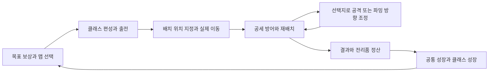

# Project T — 전체 세부 기획서

작성일: 2026-09-15 · 수정일: 2026-09-21 · 문서 버전: 0.16 · 상태: 데이터별 편집기 7종과 복수 보상·독립 확률 기반 구현. 아이템 보관·영구 저장·특별 전리품 확보는 후속 상세 결정 대기

## 1. 문서의 기준과 읽는 순서

이 문서는 **캐릭터의 자유 배치·이동 전략과 다양한 맵의 파밍을 결합한 혼합형 인크리멘탈 디펜스 게임**의 기획서다. 공통 성장·클래스별 성장·뱀서라이크식 선택지를 포함한다는 핵심 방향은 사용자 확정이다. 이동·전투의 세부 규칙, 선택 후보의 구성·발생 조건, 보상 세부 목록, 분량과 수치는 아직 협의 대상이다. 선택 효과는 한 맵의 전투 동안 유지하며 다음 출전에서 다시 선택한다. 기본 파밍 범위는 성장 재료·재화·해금이다.

| 표시 | 의미 |
| --- | --- |
| 사용자 확정 | 이번 대화에서 사용자가 명시한 조건 |
| 확인 사실 | 공식 소개 또는 현재 프로젝트 파일에서 확인한 정보 |
| 제안 | 비교·검증을 위해 작성한 설계. 사용자 확정을 대신하지 않음 |
| 미정 | 답변 또는 실험이 있어야 정할 수 있는 항목 |
| 검증 수치 | 시제품에서 실험할 시작값. 실제 균형과 제작 기간을 보장하지 않음 |

**이하 별도 표시 없는 게임 규칙과 콘텐츠는 모두 제안이다.** 기존 프로젝트의 구현 완료 상태를 뜻하지 않는다.

**개발 진행 방식 — 사용자 확정:** 앞으로 기능별 작업을 시작할 때 구성 항목·세부 값과 동작·표시 방식·화면 전환·데이터 저장 등 필요한 내용을 구체적으로 확인받고 합의된 범위에서 구현한다. 큰 방향의 채택만으로 상세 설계를 임의 확정하지 않는다. 작업 중 새 결정이나 설계 변경이 필요하면 해당 부분을 멈추고 질문하며, 중간 결과를 보여 사용자와 조정한다. 이미 확정한 사항은 반복 질문하지 않는다. 세부 절차와 설정 팝업 확인 예시는 [개발 체크 기획서](02_개발체크_기획서.md) 1.2절을 따른다.

관련 문서:

- [개발 체크 기획서](02_개발체크_기획서.md): 무엇을 어떤 순서로 만들고 무엇으로 완료를 판단하는가.
- [신규 콘텐츠 및 주요 변경 기획서](<03_신규콘텐츠 및 주요변경_기획서.md>): 새 아이디어와 큰 변경을 검토하고 기준 문서에 반영하는 기록.

## 2. 사용자 확정 조건

| 항목 | 내용 |
| --- | --- |
| 출시 | 스팀 출시, 싱글 플레이, 유료 판매 |
| 개발 | 1인 개발. 인공지능 활용, 에셋 구매와 제작으로 작업 시간 단축 가능 |
| 장르 | 맵 형태로 전투하는 디펜스 게임 |
| 성장 방향 | 전략과 수치 성장을 결합한 혼합형. 다양한 맵과 파밍의 재미를 포함 |
| 방어 요소 | 캐릭터를 원하는 위치에 배치하고 이동시킬 수 있음 |
| 이동 | 캐릭터마다 이동속도가 있고 배치 위치까지 가는 속도에 영향을 줌 |
| 경로와 배치 지형 | 적은 고정 경로를 따름. 아군은 적의 길을 포함한 통행 가능 지형에 자유 배치 |
| 아군 생성 | 클래스 버튼 드래그 또는 버튼 클릭 후 지면 클릭으로 지정한 통행 가능 위치에 바로 생성 |
| 최초 생성과 복수 배치 | 위치 확정·생성 성공 시에만 결제. 자동 선택·이동 없이 대기하며 같은 클래스 여러 명 배치 가능 |
| 이동과 교전 | 전투 중 이동 명령 가능. 이동 중 공격·저지를 중단하고 도착 후 교전 재개 |
| 부활 | 캐릭터별 대기 시간 후 쓰러진 자리에서 무료 부활. 대기 중 새 목적지 명령 가능 |
| 스테이지 1 | 초원 전장을 3라운드로 구성. 기존 궁수 에셋이 없어 원거리 마법사로 대체. 세부 수치 조정을 위임 |
| 방어 목표의 정체 | 이동식 마법 공방. 커다란 연금솥을 실은 마차를 모험가들이 지킴 |
| 전장 표시 비율 | 1920 × 1080 기준. 사용자 첨부 Tangy TD 화면보다 살짝 작은 요소 비율을 목표로 월드 요소를 기존보다 약 50% 크게 표시하며, 전체 경로와 공방을 한눈에 보여줌 |
| 배치 재화 | 적 처치로 획득하며 매 전투는 정해진 시작 금액으로 시작 |
| 보상 데이터 | 재화·아이템을 ScriptableObject 자산으로 관리. 기본 수량과 적별 수량 덮어쓰기, 복수 보상 항목 지원 |
| 처치 보상 확률 | 항목별 0~100% 독립 판정. 100%는 확정, 0%는 미지급이며 여러 항목이 동시에 당첨될 수 있음 |
| 데이터 제작 도구 | Project T 메뉴의 독립 편집기 7종. SWUtils 형태의 자산 목록·간결한 인스펙터, 생성·복제와 검사 후 적용·저장 |
| 조작과 정지 | 마우스 조작. 팝업·업그레이드 화면 등을 열 때 전투 정지 |
| 기존 코드 처리 | 이전 프로젝트 코드를 제거하고 새 전투 개발. 사용자가 직접 이전 코드 제거 완료를 알림 |
| 저지와 피격 | 근접 클래스만 적을 붙잡으며 모든 클래스가 적에게 공격받을 수 있음 |
| 성장 단위 | 공통 인크리멘탈과 클래스별 성장 |
| 선택 요소 | 파밍의 재미를 강화하는 뱀서라이크식 선택지. 효과는 한 맵의 전투 동안 유지하고 다음 출전에서 다시 선택 |
| 기본 파밍 보상 | 성장 재료·재화·해금. 장비·설계도·제작 파편을 추가 파밍 축으로 채택 |
| 장비 | 영구 보관. 소환한 캐릭터마다 장비 슬롯 2개. 스테이지 안에서 자유 장착·해제 가능하며 효과는 해당 스테이지의 해당 개체에 적용, 종료 후 장비는 인벤토리로 복귀 |
| 장비 획득 | 완제품 장비의 확률 드롭, 설계도 획득, 제작 파편 누적 후 제작을 사용. 등급은 존재하되 정확한 단계·수치·제작식은 추후 데이터 설계 |
| 희귀 전리품 회수 | 골드·일반 성장 재료·일반 제작 파편 등은 자동 획득. 완제품 장비·설계도·특수 재료 등 특별 전리품은 전장에 남고 캐릭터가 직접 이동해 확보. 확보 완료한 특별 전리품은 스테이지 실패 시에도 영구 보존 |
| 라운드 휴식 | 시간 제한 없이 이동·재배치·장비 관리·남은 희귀 전리품 회수 후 버튼으로 다음 라운드 시작. 스테이지 승리 후 결과 화면 전에도 최종 휴식. 휴식 중 부활 대기는 진행하지만 살아 있는 아군과 공방의 체력은 자동 회복하지 않음 |
| 공방 방어 | 적이 경로 끝에서 사라지지 않고 공방을 실제로 공격. 공방 공격 중인 적은 근접 아군이 실제로 저지할 때만 해당 아군으로 공격 대상 전환, 저지 해제 시 공방 공격 재개. 공방 체력 0에서 즉시 실패 |
| 공방 연금 | 전투 중 공방에서 선택지를 제공하는 운영·파밍 축을 채택. 부활 가속·추가 전리품 등 후보를 포함하며 정확한 후보·발생 시점·수치는 추후 결정 |
| 위협 강화 | 출전 시 적 공격력·이동속도 등 위험을 플레이어가 높이고, 전리품 드롭 확률·골드 등 보상을 증가시키는 위험-보상 시스템을 채택. 옵션·중첩·수치는 추후 결정 |
| 캐릭터 스킬 | 캐릭터/클래스별로 여러 스킬을 보유하고 플레이어가 교체하여 빌드를 구성하는 방향 확정. 스킬 수·장착 수·발동 방식·개별 효과는 개발 단계에서 결정 |
| 주요 시각 자산 | Epic RPG World Collection. 지형·캐릭터·몬스터 등 메인 디자인 기준 |
| 보유 보조 자산 | URP Flipbook VFX Bundle, Pixel Craft VFX - URP, All In 1, Damage Numbers Pro |
| 참고 게임 | Tangy TD, Kingdom Rush 6: Genesis TD |
| 산출물 | 전체 세부 기획서, 개발 체크 기획서, 신규 콘텐츠·주요 변경 기획서의 3종 |
| 개발 원칙 | 약어 남용 금지, SOLID 원칙, 모듈식 구조, SWUtils 사용 및 해당 코드 스타일·한글 XML 주석 |
| Unity 객체 이름 | 직접 만든 GameObject·프리팹·자산은 영어 이름. 화면 문구와 XML 주석은 한국어 유지 |
| 의사 결정 | 모호하거나 추가 기획·검증이 필요한 사항은 질문하고 결정 근거를 기록 |

플레이어의 마우스 조작은 확정했다. 개발·검증에는 Unity CLI를 사용한다. 운영체제별 출시 지원 범위, 추가 조작 장치, 목표 가격, 출시일, 개발 예산, 목표 플레이 시간은 미정이다. 스팀 출시를 곧바로 특정 운영체제만 지원한다는 의미로 해석하지 않는다.

## 3. 참고 게임에서 가져올 경험

공식 상점 소개를 확인한 날짜는 2026-09-15다. 직접 플레이한 분석은 아니다.

| 참고 | 공식 소개에서 확인한 내용 | 이 프로젝트에 대한 해석 |
| --- | --- | --- |
| Tangy TD | 직업별 타워, 장비 결합, 직업별 스킬트리, 타워 이동, 점점 어려워지는 무한 모드 | 방어 요소가 성장하며 공격 방식과 조합이 달라지는 경험을 참고 |
| Kingdom Rush 6: Genesis TD | 타워와 영웅, 주문, 고유 장치가 있는 캠페인 전장, 적 조합과 타워 시너지 | 길·배치 위치·등장 적을 읽고 대응하는 전장 설계를 참고 |

근거: [Tangy TD 공식 상점 소개](https://store.steampowered.com/app/2245620/Tangy_TD/), [Kingdom Rush 6: Genesis TD 공식 상점 소개](https://store.steampowered.com/app/4259190/Kingdom_Rush_6_Genesis_TD/).

확인일 기준 Kingdom Rush 6: Genesis TD는 출시 예정으로 표시된다. 공개 소개를 기획 참고로 사용하며 실제 플레이 품질, 정확한 성장 경제, 전투 규칙을 검증했다고 주장하지 않는다.

**조합 방향:** 길과 위치를 읽는 전투에, 이전 출전에서 얻은 힘과 클래스별 전술 변화를 더한다. 대규모 장비 목록이나 영웅 수처럼 제작량이 큰 부분은 그대로 목표로 삼지 않는다.

### 3.1 길막·피격·이동 추가 조사

확인일: 2026-09-15. 직접 실행 검증은 아니며 개발자 자료와 보조 자료를 구분한다.

| 대상 | 확인한 규칙 | 확인 범위와 한계 |
| --- | --- | --- |
| Tangy TD | 개발자가 적의 반격을 명시. 수비수의 버티기·지연 역할은 플레이어 사례에서 확인 | 특정 클래스별 피격 조건, 정확한 저지 수, 모든 적·우두머리의 예외는 미확인 |
| Kingdom Rush 기존 시리즈 | 병영 병사가 적과 근접 교전해 진행을 멈추고 피해를 받음. 집결 지점을 바꾸면 이동 | 기존 시리즈 분석 자료의 내용이며 6편의 모든 세부 규칙으로 확대하지 않음 |
| Kingdom Rush 6: Genesis TD | 공식 개발일지에서 Knights Order 병영의 전선 유지 역할과 Gerald의 근접 역할 소개 | 출시 전 공개 설명. 정확한 교전·충돌·재생성 수치는 검증하지 않음 |

근거: [Tangy TD 개발자 공지](https://store.steampowered.com/news/posts/?enddate=1748740070&feed=steam_community_announcements), [Tangy TD 플레이어 사례](https://steamcommunity.com/app/2245620/discussions/0/803469628489696728/), [Kingdom Rush 기존 전투 분석](https://www.gamedeveloper.com/design/kingdom-rush---the-wonderful-campaign-level-design), [Genesis 병영 공식 소개](https://www.ironhidegames.com/News/Details/472), [Gerald 공식 소개](https://www.ironhidegames.com/News/Details/457).

**사용자 채택:** 근접 클래스만 적을 붙잡고 모든 클래스가 피격될 수 있는 구조로 확정했다. 저지와 피격은 별도 속성으로 다룬다. 적은 고정 경로를 따르고 아군은 통행 가능 지형에 자유 배치한다. 아군 배치로 적의 우회 경로를 재계산하지 않는다. 이동 중 공격·저지 중단과 사망 자리 무료 부활을 확정했으며, 첫 스테이지의 저지 수·교전 범위·목표 선정은 위임받은 조정값으로 6.4절에 기록했다.

## 4. 두 사고법을 혼합한 분석

### 4.1 다차원 분석: 재미가 발생하는 시간과 위치를 나눈다

사용자가 제시한 두 번째 사고법을 적용한다. 가중치는 이번 기획의 주의 배분이며 시장 조사 결과가 아니다. 통찰의 중요도와 설계 영향력은 모두 1~5의 기획자 판단값이다.

| 차원 | 관찰과 통찰 | 가중치 | 중요도 | 영향력 | 가중 기여 |
| --- | --- | ---: | ---: | ---: | ---: |
| 시간 | 한 전투의 임시 강화와 여러 전투에 걸친 영구 성장은 다른 보상 주기가 필요 | 0.25 | 5 | 5 | 6.25 |
| 공간 | 같은 수호대도 길의 굴곡·교차 구간·배치 위치와 이동 소요 시간에 따라 가치가 달라져야 함 | 0.25 | 5 | 5 | 6.25 |
| 추상 | 화면에 큰 숫자가 뜨는 경험을 실제 새로운 선택으로 연결해야 함 | 0.05 | 4 | 4 | 0.80 |
| 인과 | 실패 원인을 읽고 배치 변경 또는 성장으로 다시 도전할 수 있어야 함 | 0.25 | 5 | 5 | 6.25 |
| 계층 | 공통 성장·클래스 성장·선택 효과가 다른 역할을 가져야 함 | 0.20 | 5 | 5 | 5.00 |

가중 기여는 가중치 × 중요도 × 영향력이며 합은 24.55다. 절대적인 재미 점수가 아니라 **시간·공간·실패 원인·성장 책임을 먼저 검증해야 한다**는 우선순위 표시다.

도출한 문제는 다음과 같다.

1. 성장만으로 모든 맵을 같은 배치로 깨면 맵 전략이 사라진다.
2. 성장해도 적이 플레이어 수치에 맞춰 강해지면 성장의 보상이 사라진다.
3. 모든 캐릭터를 처음부터 따로 키우면 새 캐릭터 획득이 숙제로 느껴질 수 있다.
4. 에셋 수량이 많아도 고유 행동·전장 구성·설명·균형 검증은 별도로 필요하다.

### 4.2 혁신적 솔루션: 성장의 역할을 달리 배정한다

사용자가 제시한 다섯 번째 사고법으로 위 문제를 해결할 조합을 만든다.

- 공통 성장에는 **계정 전체의 전력과 다음 목표로 가는 동력**을 맡긴다.
- 클래스 성장에는 **전문화와 공격 규칙의 변화**를 맡긴다.
- 뱀서라이크식 선택지에는 **이번 플레이의 공격 조합과 파밍 방법을 바꾸는 역할**을 제안한다. 효과 유지 기간은 별도로 결정한다.
- 캐릭터 이동에는 **지금 전력을 옮기면 언제 어디에 도착하는가**라는 시간 판단을 맡긴다.
- 맵 변화에는 **이미 본 지형에서 새로운 판단을 만드는 역할**을 맡긴다.

0.1에서는 고정 거점과 개체 강화 중심으로 비교했다. 사용자 답변을 반영한 0.2에서는 자유 배치·실제 이동·클래스 성장·파밍 선택지를 중심으로 재구성했다. 맵 재건·계승 원정은 확정되지 않은 확장 후보로 유지한다. 다음 검증에서는 이동 판단과 선택지가 파밍 목적을 어떻게 바꾸는지 관찰한다.

## 5. 차별화 아이디어 6개

모든 아이디어는 제안이며 동시에 모두 제작하는 계획이 아니다. 기존 장르에서 쓰이는 요소의 새로운 조합을 목표로 한다. 전 세계 최초라는 주장은 하지 않는다.

### 아이디어 1. 수호대 계보 — 공통으로 강해지고, 클래스별로 달라진다

- **플레이 장면:** 공통 연구로 전 수호대의 기본 전력이 오른다. 궁수 클래스의 훈련을 통해 관통 사격을 해금하고, 굽은 길에서 쓰던 궁수를 직선 구간으로 옮겨 배치한다.
- **결합:** 인크리멘탈의 축적 + 직업별 전문화 + 지형별 효율 차이.
- **차별점:** 두 성장 화면이 서로 다른 선택을 제공한다. 동일 클래스를 여러 번 배치해도 영구 연구는 공유한다.
- **작은 실험:** 궁수 한 클래스에 집중 사격과 관통 사격 두 선택을 만들고 직선 맵과 굽은 맵에서 선택 변화 관찰.
- **위험:** 특성이 공격력 증가처럼만 작동하면 성장이 다시 중복된다.
- **제안 우선순위:** 핵심 후보. 방어 형태와 성장 비중 확정 후 검증.

### 아이디어 2. 전장 재건 — 지나간 맵이 다음 전략의 일부가 된다

- **플레이 장면:** 무너진 다리를 복구해 캐릭터의 이동 시간을 줄이거나, 같은 부지에 보급소를 선택해 주변에 방어를 집중하는 구성을 비교한다. 자유 배치가 확정되어 고정 거점 해금안은 대체했다.
- **결합:** 영구 성장 + 맵 지형 + 복구 전후의 시각적 변화.
- **차별점:** 성장 결과가 메뉴와 숫자뿐 아니라 지도에 남는다.
- **작은 실험:** 한 맵에 복구 부지 하나, 선택지 두 개. 선택은 전투 밖에서 변경 가능하게 검토한다.
- **위험:** 필수 정답 시설이 생기거나 모든 맵의 제작·저장 비용이 증가할 수 있다.
- **제안 우선순위:** 핵심 재미 검증 후 대표 차별화 후보.

### 아이디어 3. 계승 원정 — 초기화할 때 다음 원정의 조건을 바꾼다

- **플레이 장면:** 첫 지역 묶음을 돌파한 뒤 원정을 재편한다. 이번에는 한 클래스의 대표 전술을 계승하고 다른 조합으로 더 높은 위협에 도전한다.
- **결합:** 환생형 반복 성장 + 선택적 보존 + 새 전술 실험.
- **차별점:** 단순히 처음부터 같은 과정을 더 빨리 하는 것에 더해 다음 회차의 선택을 바꾼다.
- **작은 실험:** 저장 사본으로 원정 종료 전후의 획득·유지·초기화 항목을 미리 보여주고 의향 조사.
- **위험:** 영구 성장 상실에 대한 거부감, 반복 초반의 지루함, 저장 이관 부담.
- **제안 우선순위:** 보류. 사용자가 환생형 반복을 원하는지 먼저 결정.

### 아이디어 4. 협동 전술 — 범위가 겹치는 자리에 공격 조합이 생긴다

- **플레이 장면:** 서리술사가 적을 둔화시키고, 그 적을 궁수가 맞히면 추가 관통이 발동한다. 같은 두 클래스도 사거리의 겹침 위치에 따라 효율이 달라진다.
- **결합:** 수호대 조합 + 공격 범위 배치 + 해금형 성장.
- **차별점:** 가까이 놓는 것 자체보다 적이 효과를 이어서 맞도록 배치하는 판단을 만든다.
- **작은 실험:** 둔화 상태 하나와 후속 공격 하나만 연결한다. 모든 속성 사이의 반응표는 만들지 않는다.
- **위험:** 연쇄 발동과 곱연산 폭증, 원인 식별 실패.
- **제안 우선순위:** 시제품의 선택 실험. 재건보다 먼저 도입할지는 비교 후 결정.

### 아이디어 5. 전술 계약 — 반복 전투의 수익을 플레이어가 조절한다

- **플레이 장면:** 이미 이긴 맵에 다시 갈 때 빠른 적 추가 또는 지원 주문 사용 제한 중 하나를 선택하고 명시된 추가 보상을 받는다.
- **결합:** 성장 재료 획득 + 선택형 난도 + 기존 맵 재사용.
- **차별점:** 단순 반복 횟수 대신 지금 감당할 위험을 선택한다.
- **작은 실험:** 계약 두 종류, 동시 선택은 한 개. 보상과 변경되는 적을 출전 전에 표시한다.
- **위험:** 쉬운 계약만 고르는 정답, 성장 필수 노동화.
- **제안 우선순위:** 반복 재미 검증 후 확장. 일일 제한이나 접속 의무는 별도 결정 사항이다.

### 아이디어 6. 신병 전수 — 새 클래스를 얻으면 바로 조합을 시험한다

- **플레이 장면:** 새 화염술사를 얻으면 공통 전력 연구는 즉시 적용된다. 추가 전수 체계를 채택하면 기존 훈련 성과 일부를 활용해 기본 특성까지 빠르게 접근한다.
- **결합:** 수집 확장 + 공통 성장 공유 + 뒤처진 클래스 따라잡기.
- **차별점:** 새 캐릭터가 기존 성장 시간을 버리게 하지 않는다.
- **작은 실험:** 새 클래스의 첫 유효 특성까지 필요한 전투 수를 측정하고, 공통 전력 공유만으로 충분한지 먼저 확인한다.
- **위험:** 무상 훈련이 기존 투자 의미를 약하게 만들 수 있다.
- **제안 우선순위:** 공통 성장 공유는 핵심안에 포함. 추가 전수 보너스는 문제 확인 후 검토.

### 5.1 아이디어의 비교 평가

다섯 번째 사고법을 단일 아이디어에 적용해 `조합 적합성 × 참신성 × 구현 가능성 × 플레이 가치 ÷ 위험`을 계산했다. 각 항목은 1~5, 위험은 높을수록 불리하다. 점수는 임시 판단이며 구현 규모와 사용자 선호에 따라 바뀐다.

| 아이디어 | 적합성 | 참신성 | 가능성 | 가치 | 위험 | 비교 지수 | 판단 |
| --- | ---: | ---: | ---: | ---: | ---: | ---: | --- |
| 수호대 계보 | 5 | 4 | 4 | 5 | 2 | 200 | 공통·개별 성장 문제에 직접 대응 |
| 전장 재건 | 5 | 4 | 3 | 5 | 3 | 100 | 지도에서 보이는 성장, 전장별 제작 부담 |
| 계승 원정 | 4 | 4 | 3 | 4 | 4 | 48 | 장기 반복 확장, 초기화 수용도 미정 |
| 협동 전술 | 5 | 4 | 3 | 5 | 3 | 100 | 배치 전략 강화, 상호작용 검증 부담 |
| 전술 계약 | 4 | 3 | 5 | 4 | 2 | 120 | 작은 데이터 변화로 반복 목적 부여 |
| 신병 전수 | 5 | 3 | 4 | 4 | 2 | 120 | 신규 클래스 사용 장벽 완화 |

위 비교 점수는 0.1의 참고 평가다. 0.2의 확정된 우선순위는 **자유 배치와 이동 → 공통·클래스 성장 → 파밍 선택지와 맵별 목표**다. 재건·계승·협동 같은 확장은 기본 경험을 확인한 뒤 판단한다. 높은 지수만으로 기능 추가를 결정하지 않는다.

## 6. 게임의 정체성과 방어 요소

### 6.1 확정된 한 문장 방향

**다양한 맵에서 캐릭터를 원하는 위치에 배치·이동시켜 침공을 막고, 공통 성장·클래스별 성장·뱀서라이크식 선택지로 파밍과 전력 강화를 이어가는 디펜스 게임.**

인크리멘탈은 반복 플레이로 자원과 성장 성과를 축적해 더 높은 목표를 돌파하는 구조를 뜻한다. 뱀서라이크식 선택지는 여러 후보를 제시하고 하나를 선택해 플레이 구성을 바꾸는 형태를 뜻하며, 후보 개수와 발동 조건은 아직 미정이다. 선택 효과의 유지 범위는 한 맵의 전투이며 다음 출전에서는 다시 선택한다.

클래스는 궁수·화염술사처럼 성장 진행을 공유하는 종류다. 제목·세계관·수호대라는 명칭은 미확정이다.

### 6.2 자유 배치와 이동

**사용자 확정:**

- 플레이어가 캐릭터를 원하는 위치에 배치할 수 있다.
- 배치한 캐릭터를 이동시킬 수 있다.
- 캐릭터마다 이동속도가 있고, 배치하러 가는 속도에 반영된다.
- 성장 소유 단위는 공통과 클래스별이다.
- 근접 클래스만 적을 붙잡으며 원거리·지원 클래스를 포함해 모든 클래스가 피격 가능하다.
- 적은 고정 경로를 따르며, 아군은 적의 길을 포함한 통행 가능 지형에 자유 배치한다.

이동속도에 따른 차이는 실제 도착 시간으로 드러나야 한다. 0.1의 고정 거점 전용 배치, 공세 사이에만 재배치하는 규칙은 현행 기준에서 제외한다. 전투 진행 중에도 이동 명령을 내릴 수 있으며 이동하는 동안 공격과 적 저지를 중단한다.

전투 중 재화로 원하는 클래스를 추가 배치한다. 클래스 버튼을 전장으로 드래그해 놓거나 버튼을 클릭한 뒤 지면을 클릭하면, 해당 통행 가능 위치에 바로 생성하고 그때 비용을 차감한다. 고정 생성 위치에서 이동하는 절차는 0.10에서 폐기한다. 생성 후 자동 선택·이동하지 않으며 새 아군 위 화살표와 목록으로 찾을 수 있다. 재화는 적 처치로 얻고 새 전투마다 정해진 금액으로 시작한다. 같은 클래스 여러 명을 배치할 수 있고 클래스 성장은 공유한다. 시작 금액·가격·처치 수입의 첫 스테이지 조정값은 6.4절에 기록한다. 전체 게임의 인원 상한과 최종 경제는 미정이며 첫 구현에는 별도 인원 상한을 추가하지 않았다.

**배치 위치 기준:** 통행 가능한 지형이면 적의 이동 경로 위에도 배치할 수 있다. 아군 배치로 적의 고정 경로를 바꾸지 않으며 근접 저지는 교전으로 처리한다. 첫 스테이지는 나무·바위·연못·구조물을 우회하며 클릭한 목적지 좌표를 유지한다. 캐릭터끼리 밀어내기와 이후 맵의 절벽·특수 지형 규칙은 추가 결정이 필요하다.

### 6.3 이동 규칙의 결정 경계

| 항목 | 확정 여부 | 현재 내용 |
| --- | --- | --- |
| 캐릭터별 이동속도 | 확정 | 배치 후 오른쪽 클릭으로 지시한 이동 속도에 반영 |
| 최초 배치 위치 | 확정 | 드래그로 놓거나 클릭한 통행 가능 지면에 바로 등장 |
| 배치 구매 | 확정 | 전투 중 재화를 지불해 원하는 클래스를 추가 배치 |
| 생성 직후 대기 | 확정 | 위치 확정 시 생성·결제·화살표 표시. 자동 선택·이동 없이 대기 |
| 경로 탐색 | 첫 구현 | 나무·바위·연못·구조물을 우회. 내부 탐색 격자와 별개로 클릭 목적지 좌표를 유지 |
| 이동 중 공격 | 확정 | 이동 중 공격과 저지 중단, 도착 후 교전 재개 |
| 적 저지·피격 | 확정 | 근접 클래스만 적을 붙잡고 모든 클래스 피격 가능 |
| 적 경로 | 확정 | 고정 경로 유지. 아군 배치에 따른 우회 경로 재계산 없음 |
| 교전 세부 | 첫 구현 | 전사 1명 저지, 마법사 저지 없음. 이동·사망 즉시 해제, 저지되지 않은 적은 고정 경로 진행. 목표 선정과 수치는 6.4절 |
| 이동 허용 시점 | 확정·첫 구현 | 전투 중 명령 허용. 첫 구현은 팝업을 닫은 뒤 전장 명령 재개 |
| 목표 변경·취소 | 확정·첫 구현 | 이동 중과 부활 대기 중 오른쪽 클릭으로 목적지 변경. 왼쪽 클릭은 선택만 처리 |
| 도달 불가 위치 | 첫 구현 | 명령을 거부하고 기존 목적지와 재화를 보존 |
| 이동 시 성장 유지 | 제안 | 위치 변경으로 이미 적용된 성장·선택 효과가 중복되거나 소실되지 않게 함 |
| 이동속도의 성장 여부 | 미정 | 공통 연구·클래스 성장·선택지의 강화 대상에 포함할지 |

이동 시간을 단순 계산할 때는 이동 가능한 실제 경로 길이를 유효 이동속도로 나눈다. 직선 거리만으로 도착을 보장하지 않는다. 정지·감속·충돌이 채택되면 경로상의 지연을 추가로 반영한다.

### 6.4 스테이지 1의 현재 구현과 조정값

사용자는 첫 화면을 단순 검증용이 아닌 스테이지 1처럼 구성하도록 요청했다. 초원 전체는 **3라운드**이며 체력·공격·이동·부활 등 세부 수치 조정은 위임했다. 아래 수치는 첫 구현의 조정값이고 출시 균형 확정값은 아니다.

| 항목 | 전사 | 마법사 | 해골 적 |
| --- | ---: | ---: | ---: |
| 배치 비용 | 30 | 40 | 해당 없음 |
| 최대 체력 | 150 | 80 | 72 |
| 초당 이동 거리 | 2.8 | 2.5 | 3 |
| 공격 피해 | 18 | 24 | 10 |
| 공격 간격 | 0.8초 | 1.35초 | 1.4초 |
| 공격 거리 | 1.05 | 4.5 | 1.05 |
| 저지 수 | 1 | 0 | 해당 없음 |
| 부활 대기 | 12초 | 16초 | 부활 없음 |

- 전투 시작 재화 100. 해골의 처치 보상은 BattleCoin 자산 참조·개별 수량 10·획득 확률 100%로 설정한다. 구매 횟수에 따른 가격 상승은 현재 없다.
- 0.10 작업 시작 시 실제 해골 자산의 이동속도는 3으로 확인했다. 기존 문서의 1.2를 현재 자산에 맞췄으며 이번 조작 개발에서 속도 자산은 변경하지 않았다.
- 라운드별 적 6·9·12명, 생성 간격 2.8초. 첫 라운드는 시작 버튼, 이후 라운드는 시간 제한 없는 휴식에서 '다음 라운드 시작' 버튼으로 진행한다.
- 공방 최대 체력 300, 해골의 공방 타격 피해 10·공격 간격 1.4초를 위임받은 첫 조정값으로 적용했다. 경로 끝 도착 자체는 피해나 적 제거를 발생시키지 않으며 실제 공격의 타격 시점에 피해를 준다. 공방 체력 0에서 즉시 패배한다.
- 마지막 라운드의 적을 모두 처치하면 최종 휴식에 들어가고 '결과 보기'를 누르면 승리 결과를 표시한다. 라운드·최종 휴식 중 이동·부활은 진행하며 살아 있는 아군과 공방은 자동 회복하지 않는다. 팝업을 열면 부활도 정지한다.
- 아군은 이동 명령 즉시 공격·저지를 중단한다. 쓰러지면 같은 개체가 사망 자리에서 무료 부활하며, 부활 대기 중 받은 마지막 목적지로 이동한다.
- 현재 자동 공격은 전사의 저지 대상 우선, 그 외에는 사거리 안에서 출구에 가까운 적 우선이다. 공방 도착 전의 적은 자신을 저지하는 아군을 먼저, 저지가 없으면 가까운 피격 가능 아군을 공격한다. 공방 도착 후에는 실제 근접 저지에만 대상을 전환하고 저지가 풀리면 공방 공격을 재개한다. 전체 클래스의 고급 대상 선택 설정은 이후 기획 범위다.
- 궁수 전용 에셋을 찾지 못했으므로 다른 캐릭터로 대체하라는 사용자 요청에 따라 Epic Collection의 원거리 마법사를 사용한다.
- `Assets/RafaelMatos/Scenes/Standard/StandardSampleSceneGL2.unity`를 조사하고 초원 룰타일의 바탕·그늘·흙길·자갈·물·긴 풀·울타리 7개 레이어를 사용했다. 망루와 야영지 소품은 데모의 구성을 참고했다. 통행 판정과 실제 지형을 함께 작성한다.
- 장면은 `Assets/01_Scenes/Stage01_Grassland.unity`, 시작 장면은 `Assets/01_Scenes/Main.unity`, 데이터는 `Assets/02_Res/Data` 아래 종류별 폴더에 있다. GameObject와 직접 만든 자산은 영어로 명명한다.
- 재화·아이템 보상 정의와 복수 보상 계산, 현재 배치 재화 지급은 연결했다. 영구 성장·선택 업그레이드·아이템 보관·영구 보상 정산·저장·다음 스테이지 해금은 아직 연결되지 않았다. 공통 전투 화면 검증은 개발 체크 2.13절, 데이터 편집·보상 기반의 최신 범위는 2.14절을 따른다.

## 7. 핵심 반복 구조



선택 효과가 한 맵 동안 유지되고 다음 출전에서 초기화된다는 점은 확정이다. 도식의 구체적인 선택 발생 시점은 미정이며 전투 도중 선택하는 흐름을 비교한 표현이다.

| 시간 범위 | 플레이어의 판단 | 보상 |
| --- | --- | --- |
| 수 초 | 적 등장 위치와 캐릭터의 도착 시간을 읽음 | 전선 공백을 줄이고 필요한 위치에 전력 도착 |
| 수십 초 | 재배치·공격·보상 선택의 기회비용 판단 | 전투 안정 또는 더 큰 파밍 기회 |
| 한 맵 | 원하는 보상에 맞는 클래스와 선택지 구성 | 성장 재료 또는 채택된 전리품 |
| 여러 출전 | 공통 성장과 클래스별 투자를 조정 | 이전 벽 돌파, 다른 맵과 파밍 목표 접근 |
| 장기 | 맵·위협·선택 구성을 바꿔 반복 | 새로운 수집·성장 목표. 세부 보상 체계는 미정 |

첫 시제품 전투 길이 6~10분, 체험판 8~15분은 기존 비교 범위이며 확정 목표가 아니다. 이동·선택 화면이 더해진 실제 시간을 측정해 다시 정한다.

## 8. 맵과 전투의 상세 규칙

### 8.1 다양한 맵이 필요한 이유

맵마다 배경뿐 아니라 이동 거리, 경로 형태, 전력 분산 필요, 얻고 싶은 보상을 다르게 구성하는 안을 제안한다. 특정 보상 때문에 특정 맵을 선택하는 구조는 보상 종류를 정한 뒤 구체화한다.

- 전투 맵은 적의 진입로·이동 경로·방어 목표, 캐릭터의 통행 영역·배치 가능 영역, 장식으로 구분한다.
- **사용자 확정:** 적은 정해진 길을 따른다. 아군 배치로 적의 우회 경로를 다시 계산하지 않는다.
- 캐릭터의 통행과 적의 통행은 같은 그림을 사용하더라도 별도 규칙으로 다룬다.
- 직접 제작한 맵으로 시작하는 안을 유지한다. 맵 수와 환경 수는 검증 후 확정한다.
- 배치 위치를 정해 두는 대신, 위치마다 사거리·체류 시간·이동 거리의 차이가 의미 있는지 확인한다.

### 8.2 첫 스테이지: 초원 경계

| 요소 | 현재 구성 |
| --- | --- |
| 지형 | 초원과 마을 입구. 굽은 길, 짧은 직선, 캐릭터가 이동할 수 있는 영역 |
| 적 경로 | 초원을 가로지르는 굽은 고정 경로 하나. 6.4절과 실제 경로 자산 참조 |
| 배치 | 고정 슬롯 없이 유효 영역에서 목표 위치 지정 |
| 캐릭터 수 | 전사·마법사를 전투 재화로 반복 구매. 같은 클래스 여러 명 허용 |
| 공세 | 스테이지 전체 3라운드. 이전 8공세 후보를 첫 스테이지에 적용하지 않음 |
| 이동 시험 | 같은 출발점과 목적지에서 서로 다른 이동속도의 실제 도착 시간 비교 |
| 선택 시험 | 한 맵에만 적용되는 공격 안정·획득량·위험 증가 선택을 비교. 수량과 출현 시점 미정 |
| 파밍 시험 | 기본 보상과 선택으로 추가된 보상을 결과에서 구분 |
| 재건 | 채택되지 않은 확장 후보 |

### 8.3 전투 상태

0.9 구현은 준비 → 라운드 진행 → 라운드 휴식 → 다음 라운드 진행 → 최종 휴식 → 승리 결과 순서다. 공방이 파괴되면 즉시 패배 결과로 전환한다. 각 라운드의 적이 정리되면 다음 라운드를 플레이어가 시작하기 전까지 이동·재배치할 수 있다. 마지막 라운드의 적을 모두 처치한 뒤에도 최종 휴식에서 이동하다가 '결과 보기'를 눌러 결과 화면으로 넘어간다. 장비 관리·남은 특별 전리품 회수는 해당 기능 구현 후 휴식에 연결한다. **0.8.1 사용자 확정·0.9 구현:** 휴식에는 시간 제한을 두지 않으며 다음 라운드는 버튼으로 직접 시작한다. 휴식 중 부활 대기시간은 계속 진행하고 기존 규칙대로 부활하지만, 살아 있는 아군과 공방의 체력은 자동 회복하지 않는다. 팝업을 열면 기존 일시정지 규칙에 따라 부활 대기도 정지한다. 휴식 중 공방 연금 사용 가능 여부는 추후 결정한다.

0.7 구현에서는 적이 경로 끝에 도달할 때 공방 내구도를 즉시 1 감소시키고 적을 종결했지만, **0.9에서 0.8 확정 규칙으로 교체했다.** 적은 공방에 도착하면 사라지지 않고 공방을 실제 대상으로 공격한다. 캐릭터가 뒤늦게 이동해 해당 적을 처치할 수 있으며 공방 체력이 0이 되는 순간 스테이지가 실패한다. 첫 공방 체력·해골의 공방 피해·공격 주기는 6.4절의 조정값을 사용한다. 공방 수리 기능과 수치의 채택은 추후 결정한다. 아군은 사망 자리에서 무료 부활하며 부활 대기 중에는 공격·저지를 하지 않아 적이 그대로 통과할 수 있다. 판매·철수 규칙은 이후 범위다.

**0.8.1 사용자 확정 — 공방 공격 중 목표 전환:** 근접 아군이 해당 적을 실제로 저지할 때만 공격 대상을 저지 아군으로 전환한다. 아군이 단순히 가까이 있거나 사거리 안에 들어왔다는 이유로 공방 공격을 중단하지 않는다. 저지 아군이 이동하거나 사망해 저지가 해제되면 공방 공격을 재개한다. 이 규칙은 공방 공격 상태에 적용하며, 공방 도착 전의 기존 아군 공격 대상 선정과 구분한다.

선택 팝업·업그레이드 화면을 열 때 전투를 정지하는 방향은 확정했다. 여러 선택이 동시에 발생하면 순서대로 보여줄지는 정해야 한다. 메뉴를 열고 닫는 동작이 공세 진행이나 보상을 중복시키면 안 된다.

### 8.4 배치·성장·선택의 구분

| 동작 | 상태와 내용 |
| --- | --- |
| 편성 | 첫 스테이지 전사·마법사, 같은 클래스 복수 배치 허용. 전체 게임 편성 제한은 미정 |
| 최초 배치 | 버튼 드래그 또는 버튼 클릭 후 지면 클릭으로 그 위치에 생성·결제. 왼쪽 선택 후 오른쪽 이동. 첫 가격은 6.4절 |
| 재배치 | 전투 중 무료 이동 명령. 이동 중 공격·저지 중단. 부활 대기 중 목적지 예약 |
| 전투 중 개체 구매 강화 | 0.1의 1~3단계 강화는 선택 후보로 변경. 뱀서라이크식 선택과 함께 둘지 확인 필요 |
| 클래스 영구 성장 | 클래스별 진행을 둔다는 방향 확정. 수치·전문화·선택 후보 해금 중 역할 배분은 제안 |
| 뱀서라이크식 선택 | 한 맵 동안 적용하고 새 출전에서 초기화 확정. 후보 개수·종류·발생·중복·재선택 규칙 미정 |
| 판매·철수 | 캐릭터 비용과 생명주기를 정한 뒤 결정. 기존 70% 환급은 현행 규칙으로 채택하지 않음 |
| 자동 목표 선정 | 첫 구현은 자신이 저지한 적 우선, 그 외 사거리 안에서 출구까지 남은 경로가 짧은 적 우선. 이동 명령 중에는 공격 중단 |

### 8.5 적·피해·이동의 경계 사례

0.7 구현 기록: 첫 스테이지는 적 한 명 통과 시 방어 여유 1 감소, 시작 방어 여유 10으로 구현했다. 이 통과 판정은 0.9에서 8.3절의 공방 실제 공격 규칙으로 교체했다. 이전 우두머리 피해 5와 내구도 20 후보는 현재 스테이지에 적용하지 않는다.

- 경로 끝 도착은 공방 공격 상태 진입이며 적의 종결이나 보상 지급이 아니다. 적 처치와 보상은 한 번만 확정한다.
- 이동 완료와 적 피격·사망이 겹칠 때의 처리 순서는 캐릭터 생명주기와 함께 정한다.
- 첫 전사는 적 1명을 저지하고 이동·사망하면 해제한다. 여분 적은 고정 경로를 계속 진행한다. 캐릭터끼리 밀어내기는 구현하지 않았다.
- 원거리·지원 클래스는 저지를 하지 않지만 피격될 수 있다. 근접전·원거리 공격·범위 공격의 표적 조건은 적별로 정의한다.
- 이동 중에는 공격을 중단하고 도착 후에만 재개하는지 검증한다.
- 첫 상태 효과는 둔화 하나부터 비교한다. 최대 감속 50%, 가장 강한 둔화만 적용은 검증 후보다.
- 공격 피해의 수치 확정 시점, 목표 소실 시 투사체 처리, 연쇄 최대 횟수는 선택 효과와 함께 정한다.

### 8.6 조작과 정보

**사용자 확정:** 마우스로 조작하며 팝업·업그레이드 화면 등을 열 때 전투를 정지한다. 개발·검증은 Unity CLI를 사용한다. 스페이스 키 정지는 채택하지 않았다.

클래스 버튼을 드래그해 지면에 놓거나 버튼을 클릭한 뒤 지면을 클릭해 배치한다. 버튼만 클릭한 상태에서는 생성·결제하지 않는다. 배치 중 캐릭터와 실제 공격 범위를 미리 보여주며 가능한 위치는 초록색, 장애물·잔액 부족은 빨간색으로 표시한다. 화면 요소 위·화면 밖에는 미리보기를 숨긴다. 잘못된 위치에 확정·드롭하면 배치를 취소하고 비용을 보존한다. 오른쪽 클릭·Esc·팝업 진입·창 포커스 이탈도 미결제 배치를 취소한다. 배치 완료 뒤 자동 선택·이동하지 않으며 직접 선택할 때까지 머리 위에 화살표를 표시한다.

아군 몸체 또는 목록을 왼쪽 클릭하면 해당 클래스의 실제 공격 거리를 원으로 표시한다. 이동·부활 대기 중에는 공격이 비활성이라는 것을 색으로 구분한다. 오른쪽 클릭으로 이동을 지시하면 **선택한 캐릭터의 최신 목적지만 도착할 때까지** 원과 십자 표시로 보여준다. 선택을 해제하거나 다른 아군을 선택하면 이전 아군의 표시는 숨기며 다시 선택하면 아직 남은 목적지를 표시한다. 부활 후 이동 예약도 같은 목적지 표시를 사용한다. 잘못된 이동 위치는 거부하고 기존 명령과 목적지 표시를 유지한다.

빈 땅 왼쪽 클릭은 배치 중이 아닐 때 선택을 해제하며 이동하지 않는다. 아군이 겹치면 최근 배치한 아군을 먼저 선택하고 나머지는 목록에서도 선택한다. 공방 바로 위에 체력바를 항상 표시하며 상단의 현재/최대 체력과 같은 상태를 읽는다. 체력 0에서는 빈 바를 표시한다. 다중 선택·이동 경로 선·예상 도착 시간·배속은 후속 결정 대상이다. 여러 정지 화면이 겹쳐도 마지막 화면까지 닫기 전에는 전투가 재개되지 않는다.

참고: [Tangy TD 공식 소개](https://store.steampowered.com/app/2245620/Tangy_TD/)의 클래스 배치와 타워 이동 방향을 참고했다. 두 가지 배치 입력과 목적지 표시 범위는 2026-09-16 사용자 답변으로 확정한 Project T 규칙이며, 참고 작품의 세부 입력을 그대로 확인했다는 뜻은 아니다.

직접 조작하는 별도 영웅과 지원 주문은 이동 가능한 클래스 캐릭터와 별개의 선택 사항이다. 이미 이동이 확정된 캐릭터를 추가 영웅 기능으로 오해하지 않는다.

### 8.7 캐릭터 고유 스킬 — 다중 스킬 교체형 빌드

**사용자 방향 확정:** 캐릭터 또는 클래스는 여러 개의 고유 스킬을 가질 수 있고, 플레이어가 스킬 구성을 직접 교체해 빌드를 만든다. 현재 전사·마법사는 기본 공격만 구현되어 있으며 고유 스킬 코드 구현 진행률은 0%다.

고유 스킬은 영구적으로 해금·보유하는 선택 자산이고, 실제 출전에서 어떤 스킬을 장착할지는 플레이어가 정하는 구조를 기준으로 한다. 같은 클래스 여러 개체가 존재하더라도 클래스가 가진 스킬 풀과 개별 개체의 현재 장착 구성을 구분한다. 장비 2슬롯과 스킬 구성은 서로 다른 빌드 축이며, 뱀서라이크식 한 맵 선택 효과와도 별도로 관리한다.

개발 착수 전에 다음 세부를 정한다.

- 클래스별 전체 스킬 수와 한 번에 장착 가능한 스킬 수.
- 자동 사용·직접 사용·조건부 발동 등 각 스킬의 발동 방식과 조작 방법.
- 재사용 대기시간·비용·대상 선정·범위·발동 조건.
- 이동·사망·부활·휴식·일시정지 중 스킬과 대기시간의 처리.
- 공통 성장·클래스 성장·설계도/해금·한 맵 선택과 스킬 강화의 관계.
- 스킬 교체를 출전 전만 허용할지, 휴식 구간에서도 허용할지.

이전 문서의 '전투 스킬 1개 + 지속 특성 1개'와 자동 사용 추천은 폐기한다. 구체 데이터는 스킬 개발 단계에서 정하되 **여러 스킬을 보유하고 교체해 빌드를 구성한다는 방향은 확정**이다.

### 8.8 장비 장착과 전투 중 개체 빌드

- 모든 소환 캐릭터는 **장비 슬롯 2개**를 가진다.
- 장비는 계정/영구 진행에 보관되며 스테이지 입장으로 소모되지 않는다.
- 전투 중 소환한 캐릭터에게 보유 장비를 장착·해제·교체할 수 있다. 장비 화면을 열 때는 기존 팝업 규칙과 같이 전투를 정지한다.
- 장비 효과는 해당 스테이지에서 장착한 해당 개체에만 적용한다. 스테이지 종료 시 모든 장비는 자동으로 영구 인벤토리로 돌아온다.
- 같은 클래스 여러 명에게 서로 다른 장비를 주어 전선 유지형·기동형 등 개체 역할을 다르게 만들 수 있다.
- 장착/해제를 반복해 체력 회복·부활 가속·보상 지급 같은 일회성 효과를 중복 발동할 수 없도록 효과의 출처와 상태를 분리한다.
- 장비 등급은 존재한다. 등급 단계, 같은 장비의 등급별 차이, 옵션 구조, 슬롯 중복 제한 등 세부 데이터는 추후 결정한다.

## 9. 공통 성장·클래스 성장·파밍 선택지

### 9.1 확정 방향과 남은 설계

**혼합형 확정:** 수치 상승의 성취감, 배치·이동·조합의 전략, 다양한 맵의 파밍을 함께 추구한다. 공통 인크리멘탈과 클래스별 성장, 뱀서라이크식 선택지에 더해 **영구 장비 수집·설계도/파편 제작·위협 강화**를 파밍과 빌드의 축으로 포함한다.

기본 파밍 보상인 성장 재료·재화·해금은 유지한다. 여기에 장비 완제품·장비 설계도·제작 파편을 추가한다. 장비는 영구 보관되고 캐릭터당 2슬롯을 사용한다. 정확한 등급표·옵션 수치·제작식·드롭 테이블은 데이터 설계 단계에서 정하며, 무작위 접두사/접미사나 분해 시스템은 아직 채택하지 않는다.

### 9.2 세 성장 축과 선택적 보조 기능

| 축 | 확정 범위 | 역할 제안 | 유지 범위 |
| --- | --- | --- | --- |
| 공통 인크리멘탈 | 포함 확정 | 전체 전력·성장 효율·상위 목표 접근 | 출전 간 누적 성장. 환생 초기화 여부 별도 |
| 클래스 성장 | 클래스 단위 확정 | 클래스 전력·전문화·사용할 수 있는 선택 후보 확장 | 클래스별 누적 진행 |
| 뱀서라이크식 선택 | 포함과 수명 확정 | 공격 조합·자원 획득·위험과 보상 조정 | 한 맵의 전투 동안 유지, 새 출전에서 초기화 |
| 개체별 전투 구매 강화 | 미확정 후보 | 지금 어느 캐릭터에 전투 자원을 투자할지 | 채택 시 유지 기간 별도 결정 |

공통 연구의 효과를 클래스마다 다시 구매하게 만드는 방식은 피하는 안을 제안한다. 클래스 성장 재료를 전투 결과로 공용 지급할지, 해당 클래스의 출전에 따라 얻을지는 미정이다. 보조 클래스가 피해량이 낮다는 이유로 성장이 막히는 상황을 검증해야 한다.

### 9.3 공통 인크리멘탈 역할 제안

- 전력 연구: 전체 공격 수치에 반복 배율을 준다.
- 보급·파밍 연구: 획득 기회 또는 편의를 강화한다. 획득량 증가만이 항상 우선되는지 비교한다.
- 진행 해금: 상위 위협, 새 클래스, 새 선택 후보에 접근한다.
- 이동속도 연구: 이동 시간을 줄이는 성장 후보. 장기 성장 후 모든 이동이 사실상 즉시 완료되면 이동 전략이 사라지는 문제를 검증한다.

이 항목들은 확정된 공통 성장의 세부 구성 제안이다. 여러 곱연산을 자동으로 중첩하지 않고 적용 출처와 순서를 명시한다.

### 9.4 클래스 성장과 선택 후보의 연결 예시

| 클래스 후보 | 기본 역할 | 영구 성장으로 해금할 후보 | 플레이 중 선택할 효과 예시 |
| --- | --- | --- | --- |
| 궁수 | 빠른 단일 공격 | 관통·집중 사격 계열 | 여러 적 관통 / 단일 정예 집중 |
| 화염술사 | 범위 피해 | 잔불·연쇄 폭발 계열 | 잔불 지속 증가 / 무리 처리 강화 |
| 서리술사 | 둔화와 제어 | 넓은 둔화·긴 둔화 계열 | 적을 모아 다른 공격의 효율 증가 |
| 기수 | 주변 지원 | 지휘·보급 계열 | 아군 전투 지원 / 파밍 보조 |

클래스 성장은 후보를 영구 해금하고, 실제 효과는 선택으로 얻는 구조를 추천 후보로 둔다. 영구 전문화와 선택 효과가 각각 같은 배율을 중복 지급하지 않도록 설계한다. 선택한 효과는 한 맵이 끝나면 사라지지만, 영구적으로 해금한 후보 자체는 유지하는 안이다. 후보 해금 조건과 적용 방식은 별도 확정한다.

### 9.5 공통 성장 계산 예시

다음은 이전 초안의 검증 수치를 유지한 계산 예시다. 확정된 경제 곡선이 아니다.

```text
공통 공격 배율 = 1.06 ^ 공통 전력 연구 레벨
다음 연구 비용 = 올림(20 × 1.16 ^ 현재 연구 레벨)
공격 피해 = 기본 피해 × 공통 배율 × 클래스 효과 × 선택 효과
```

| 공통 연구 레벨 | 공통 공격 배율 | 누적 비용 | 다음 비용 |
| --- | ---: | ---: | ---: |
| 0 | 1.00 | 0 | 20 |
| 5 | 1.34 | 140 | 43 |
| 10 | 1.79 | 432 | 89 |
| 20 | 3.21 | 2,318 | 390 |

클래스 효과와 선택 효과가 각각 1일 때 기본 피해 10, 연구 5의 피해는 약 13.38이다. 개체별 구매 강화를 채택하면 해당 배율을 추가로 정의한다. 기존 1~3단계 배율을 묵시적으로 유지하지 않는다.

연구 상한 20은 첫 검증 후보다. 상위 맵·위협의 수입과 목표가 없다면 비용만 증가해 파밍이 지루해질 수 있으므로 성장 간격을 함께 측정한다.

### 9.6 적 난도와 성장의 관계

같은 맵·같은 위협에서는 플레이어 성장에 맞춰 적 체력이 자동 증가하지 않는 안을 제안한다. 성장이 누적되면 이미 돌파한 맵의 파밍이 빨라지는 경험을 허용한다.

상위 위협은 새 적 조합·진입 시점·체력·보상 중 명시된 항목을 바꾼다. 파밍 선택지로 추가한 위험은 기본 위협과 구분해 예고한다. 입장 조건, 강제 반복 횟수, 공세 길이는 미정이다.

### 9.7 뱀서라이크식 선택지의 상세 설계 경계

| 항목 | 비교할 안 | 현재 상태 |
| --- | --- | --- |
| 발생 | 경험 누적 / 공세 완료 / 정예·우두머리 보상 / 특정 지점 도착 | 미정 |
| 후보 개수 | 3개 중 1개 선택을 첫 비교안으로 제안 | 미정 |
| 적용 대상 | 전체 / 선택한 클래스 / 특정 캐릭터 | 미정 |
| 유지 | 한 맵의 전투 동안 적용하고 다음 출전에서 다시 선택 | 사용자 확정 |
| 선택 중 시간 | 선택 팝업·업그레이드 화면을 열면 전투 정지 | 팝업·업그레이드 정지 확정. 화면 구성은 미정 |
| 중복 | 단계 상승 / 같은 효과 재등장 금지 / 상한 후 대체 | 미정 |
| 후보 풀 | 기본 공통 후보 + 출전 클래스 후보 + 맵 후보 | 제안 |
| 재선택·건너뛰기 | 횟수·비용·영구 해금 방식 | 미정 |
| 전리품 연결 | 성장 재료·재화·해금에 대한 보상량·비중·획득 기회 | 기본 종류 확정, 세부 규칙 미정 |

**검증할 규칙 후보:** 현재 사용할 수 없는 클래스의 효과, 이미 최대 단계인 효과, 유효하지 않은 전리품 종류는 후보에서 제외한다. 후보가 부족할 때의 대체 선택을 둔다. 선택을 저장·복원할 때 후보를 다시 추첨하거나 같은 보상을 중복 지급하지 않도록 한다.

공격 선택과 파밍 선택이 섞여 있어도, 파밍을 고르면 진행이 불가능해지거나 공격을 고르면 손해만 보는 구도가 되지 않게 한다. 위험·기회비용과 기대 보상을 함께 표시한다.

## 10. 파밍과 보상 경제

### 10.1 파밍의 확정 목표와 보상 범위

**사용자 확정:** 다양한 맵이 있고 파밍하는 재미가 있어야 한다. 기본 보상은 성장 재료·재화·해금이며 선택지가 그 재미를 강화한다. 더 나은 보상 아이디어는 추가 제안을 검토한다.

| 기본 보상 | 반복 목적 제안 | 남은 설계 |
| --- | --- | --- |
| 성장 재료 | 공통 또는 특정 클래스의 다음 성장에 도달 | 재료 종류·맵별 획득·소비처 |
| 재화 | 반복 강화와 선택 가능한 투자 | 영구·전투 재화 구분, 비용과 수입 곡선 |
| 해금 | 새 클래스·선택 후보·맵·위협에 접근 | 획득 조건, 중복 처리, 확률과 확정 보상 비중 |

**장비 파밍 채택:** 맵별 파밍 목적에는 성장 재료·재화·해금뿐 아니라 장비 완제품·장비 설계도·제작 파편을 포함한다. 완제품은 낮은 확률의 즉시 보상, 제작 파편은 반복 플레이의 누적 진행, 설계도는 새로운 제작 목표와 맵별 파밍 목적을 담당한다. 특정 선택 계열이나 클래스 전술을 여는 연구 설계도와 장비 설계도는 데이터에서 구분한다.

보조 후보인 외형·공격 연출 해금은 유지한다. 장비 분해·랜덤 접두사/접미사·세트 효과·거래 기능은 아직 채택하지 않는다.

### 10.2 맵별 파밍 목적 제안

| 맵 후보 | 전술 차이 후보 | 파밍 목적 후보 |
| --- | --- | --- |
| 초원·마을 | 넓은 이동 공간과 기본 진입로 | 안정적인 공통 성장 재료 |
| 묘지·납골당 | 갈라지는 적 접근과 전력 재배치 | 클래스 성장 또는 특정 능력 관련 보상 |
| 화산 | 위험 구역과 긴 이동 경로 | 높은 위험에 대응하는 상위 보상 |

성장 재료·재화·해금이라는 기본 범위 안에서 실제 보상 이름과 표를 정한다. 맵마다 다른 통화를 반드시 추가하는 방식은 아니다. 가장 효율적인 한 맵만 반복하는 정답을 줄이면서 낮은 단계의 맵도 선택할 이유를 검토한다.

### 10.3 재화와 정산의 임시안

기존 초안의 연구 결정·훈련 기록은 영구 재료 후보 이름이다. **배치에 쓰는 전투 재화는 채택되었다.** 적 처치로 획득하며 매 전투는 설정된 시작 금액으로 시작한다. 현재 첫 스테이지는 BattleCoin 자산을 배치 재화로 참조하고 화면에는 코인을 표시한다. 시작 100·해골 처치 10(확률 100%)·전사 30·마법사 40으로 조정했다. 경제 균형은 추후 검증한다. 전투 재화를 영구 성장 재료와 합치지 않으며 이전 시제품의 골드·에센스·경험치와 자동 대응시키지 않는다.

기본 보상 검증 예시는 8공세 기준 다음과 같다. **추가 선택지·전리품 배율을 적용하기 전 값**이며 현행 경제 확정값이 아니다.

| 상황 | 연구 결정 후보 | 훈련 기록 후보 |
| --- | ---: | ---: |
| 완료 공세 한 번 | 4 | 1 |
| 승리 추가 | 8 | 2 |
| 해당 맵·위협 최초 승리 추가 | 20 | 10 |
| 반복 승리 합계 | 40 | 10 |
| 최초 승리 합계 | 60 | 20 |
| 4공세 완료 후 다음 공세 패배 | 16 | 4 |

공세 완료는 해당 공세의 적이 모두 처리되고 목표 내구도가 남는 상태로 제안한다. 결과 장부에 기본 보상, 선택에 의한 추가 보상, 전리품, 최초 보상을 구분한다. 패배·포기 때 보존되는 보상과 전리품은 보상 체계 결정 후 확정한다.

### 10.4 확정 방향에서 도출한 아이디어 4개

아래는 다차원 분석의 공간·시간·성장 계층을 혁신적 솔루션의 조합 방식으로 연결한 **새 후보**다. 구체 기능의 채택을 뜻하지 않는다.

| 아이디어 | 실제 선택 장면 | 파밍과 전략의 연결 | 최소 검증과 위험 |
| --- | --- | --- | --- |
| 맵별 목표 파밍 | 이번에는 필요한 클래스 재료가 잘 나오는 묘지를 선택 | 맵 선택을 성장 목표와 연결 | 맵 2개·목표 보상 2개로 비교. 한 맵이 모든 보상에서 우월한지 확인 |
| 위험을 고르는 전리품 선택 | 안전한 전투 강화와 추가 정예가 주는 보상 기회 중 선택 | 현재 전력으로 감당할 위험을 판단 | 정예 기회 1종부터. 보상만 늘어나는 필수 정답 방지 |
| 클래스 성장으로 선택 후보 해금 | 궁수 성장으로 관통 계열 후보를 얻고 전투에서 구성 | 영구 성장이 다음 파밍 방식의 가능성을 확장 | 클래스 1종·계열 2개로 비교. 후보가 늘수록 원하는 효과가 안 나오는 역효과 확인 |
| 이동을 활용하는 수색 기회 | 캐릭터 하나를 옆길 보상 지점으로 보내 방어 전력과 교환 | 이동속도·전선 공백·획득 기회를 연결 | 고정 보상 지점 하나부터. 모든 캐릭터를 계속 왕복시키는 조작 노동인지 확인 |

네 번째 아이디어의 보상 지점·수색 기능은 새 제안이다. 배치·이동만 확정됐다는 사실을 넘어 자동으로 채택하지 않는다. 빠른 클래스가 전투와 파밍 모두에서 항상 우수해지지 않도록 역할 비용을 함께 비교한다.

### 10.5 경제 검증 항목

- 기본 보상과 선택으로 추가된 보상을 결과에서 구분할 수 있는가.
- 같은 성장 상태에서 공격 안정 선택과 파밍 선택이 모두 의미 있는가.
- 목표 획득까지 소요 출전 수와 준비·이동·선택 시간을 포함한 시간당 수익은 어떤가.
- 실패·포기만 반복하거나 저장을 다시 불러오는 것이 정상 파밍보다 유리하지 않은가.
- 같은 클래스의 복수 캐릭터가 획득 배율을 의도보다 중복 적용하지 않는가.
- 맵별 목표 보상 때문에 다른 맵을 자발적으로 방문하는가.
- 지속적으로 성장한 뒤에도 이동속도 차이와 전선 재배치가 의미 있는가.

자동 반복, 전투 생략, 미접속 보상, 환생은 여전히 미정이다. 반복 파밍을 강조했다는 답변이 이 기능들을 포함한다는 뜻은 아니다.

### 10.6 위협 강화와 보상 배율

출전 전에 플레이어가 적에게 불리한 강화 조건을 부여하고 그만큼 파밍 보상을 높이는 **위협 강화 시스템**을 채택한다. 목적은 단순 난도 선택이 아니라, 현재 빌드로 감당 가능한 위험을 스스로 선택해 원하는 보상을 노리는 것이다.

첫 데이터 후보는 적 공격력 증가, 이동속도 증가, 체력 증가, 적 수 증가, 아군 부활 대기 증가 등이다. 보상 후보는 골드·성장 재료·장비 제작 파편 획득량, 특별 전리품 드롭 확률, 설계도/완제품 장비 드롭 기회 증가다. 정확한 옵션·중첩 수·배율·상한은 추후 결정한다.

위협 옵션은 적용되는 위험과 증가하는 보상을 출전 전에 함께 보여준다. 한 옵션이 모든 빌드에서 항상 최적이 되지 않게 하며, 저장·재도전으로 드롭만 다시 굴리는 악용을 방지한다.

### 10.7 특별 전리품의 자동 획득과 직접 확보

전리품은 **자동 획득**과 **직접 확보** 두 종류로 나눈다.

- 자동 획득: 전투 배치 재화, 골드, 일반 성장 재료, 일반 제작 파편 등 반복적으로 많이 발생하는 보상. 처치·조건 완료 시 바로 장부에 기록한다.
- 직접 확보: 완제품 장비, 희귀 설계도, 특수 제작 재료 등 발견 자체가 중요한 특별 전리품. 전장에 실제 드롭 오브젝트로 남긴다.
- 직접 확보 절차: 캐릭터 선택 → 특별 전리품에 이동 명령 → 도착 후 짧은 확보 진행 → 확보 완료 시 이동식 마법 공방이 자동 회수하여 영구 보관.
- 확보를 위해 이동하는 동안 기존 이동 규칙에 따라 공격·저지를 중단한다. 확보 진행 중에도 공격·저지를 하지 않는다.
- 확보 중 캐릭터가 사망하거나 다른 이동 명령을 받으면 확보를 취소하고 전리품은 바닥에 남긴다. 다른 캐릭터가 다시 확보할 수 있다.
- 특별 전리품은 임의의 짧은 시간 제한으로 소멸시키지 않고 해당 스테이지의 회수 가능 구간 동안 유지한다.
- 각 라운드 휴식 구간에서 남은 특별 전리품을 회수할 수 있다. 마지막 라운드 승리 후 결과 정산 전 최종 휴식에서도 남은 전리품을 회수할 수 있다.
- **한 번 확보 완료한 완제품 장비·설계도·특별 전리품은 이후 스테이지에 실패하더라도 영구 인벤토리에 남는다.** 미확보 전리품은 실패 시 획득하지 않는다. 일반 수량형 보상의 실패 정산 비율은 추후 결정한다.
- 넓은 전장에서 발견을 놓치지 않도록 특별 전리품에는 빛기둥·아이콘·화면 가장자리 방향 표시·짧은 알림음 등 가시성 수단을 둔다.

### 10.8 공방 연금 선택

이동식 마법 공방은 방어 대상인 동시에 전투 운영 선택을 제공하는 장치로 확장한다. **공방 연금 선택은 캐릭터의 공격 빌드를 만드는 뱀서라이크식 선택과 역할을 분리**하고, 전투 전체의 운영·생존·파밍을 조정한다.

현재 채택한 대표 방향은 다음과 같다.

- 부활 가속: 전체 또는 현재 부활 중인 캐릭터의 부활 대기 감소.
- 추가 전리품: 특별 전리품·제작 파편 등 파밍 기회 강화.
- 공방 생존: 공방 수리 또는 방어 보조 후보.
- 전투 경제: 배치 재화·보상 효율 조정 후보.

정확한 후보 수, 발생 시점, 중복·재선택, 비용, 수치는 추후 결정한다. 공방 연금은 위협 강화와 결합할 수 있지만 동일한 위험/보상을 두 시스템에서 중복 계산하지 않는다.

### 10.9 재화·아이템 정의와 독립 확률 보상 — 2026-09-21 확정·1차 구현

재화와 아이템은 각각 `CurrencyDefinition`, `ItemDefinition` 자산으로 만든다. 공통 정의에는 표시 이름·선택 아이콘·기본 수량을 두며, 보유 잔액이나 인벤토리 수량을 저장하지 않는다. 기본 수량은 보상에서 사용할 기본 지급량이다.

- 적은 `RewardEntry` 목록으로 여러 보상을 참조한다. 수량 덮어쓰기를 끄면 자산의 기본 수량을, 켜면 해당 항목의 개별 수량을 사용한다. 원본 정의는 바꾸지 않는다. SWStatOverride와 유사한 원본·개별값 분리 방식이며 현재 SWStat 자체를 연결한 구조는 아니다.
- 편집 항목은 **획득 확률 (%)**로 표시한다. 항목마다 독립적으로 한 번 판정하므로 전체 합을 100으로 맞출 필요가 없고 다른 항목을 추가해도 기존 확률은 변하지 않는다. 코인 100%·아이템 20%이면 코인은 항상 계산되고 아이템은 별도로 20% 판정된다. 이는 설명 예시이며 실제 아이템 드롭표 확정값은 아니다. 상대 가중치로 하나만 뽑는 방식을 사용하지 않는다.
- 참조 누락, 음수·유한하지 않은 수량, 0~100 범위를 벗어난 확률은 거부한다. 수량 0 또는 확률 0인 항목은 지급 결과에서 제외한다. 전체 목록을 검증한 뒤 계산하고, 실패하면 일부 보상만 지급하지 않는다.
- 실제 지급은 스테이지의 배치 재화 참조와 같은 자산에 한한다. 당첨된 해당 재화 수량을 합산해 전투 지갑에 한 번 반영한다. 아이템과 다른 재화는 계산 결과만 제공하며 소유권·영구 잔액을 만들지 않는다.
- Stage01은 BattleCoin을 사용하고 Skeleton은 개별 수량 10·확률 100%로 기존 처치 수입을 유지한다. 기존 단일 처치 재화 필드는 이관 호환용으로 숨겨 두며 현재 계산에는 사용하지 않는다.

**후속 범위:** 아이템 실제 획득·보관, 영구 저장과 저장용 식별자, 특별 전리품의 전장 생성·직접 확보·실패 보존, 장비·설계도·제작 파편의 세부 타입과 규칙은 이후 확장한다. 독립 확률 계산 완료를 영구 획득이나 특별 전리품 확보 완료로 간주하지 않는다. 기존 직접 확보 규칙은 10.7절을 유지한다.

## 11. 콘텐츠의 제작 범위

수량은 1인 개발의 검증용 범위 제안이며 납기 약속이 아니다.

| 단계 | 맵·환경 | 클래스 | 적 | 성장과 기능 |
| --- | --- | --- | --- | --- |
| 핵심 전투 시제품 | 초원 전장 1개 | 근접·원거리·지원 3역할을 후보로 선정 | 기본·빠름·무리·내구형 4역할 | 자유 배치·실제 이동·패배·승리 |
| 성장·파밍 검증 시제품 | 맵 2개, 맵별 보상 목적 구분 | 3종, 클래스별 선택 계열 후보 | 기존 적 조합 변경 | 공통·클래스 성장, 한 맵 선택, 정산·저장 |
| 공개 체험판 후보 | 환경 1개, 맵 3개 | 4종 | 일반 6종, 우두머리 1종 | 짧은 진행 곡선과 대표 차별화 1개 |
| 첫 출시 범위 후보 | 환경 3개, 맵 9개 | 6종 | 일반 12종, 우두머리 3종 | 지역 진행·선택 위협·지속 성장 |

출시 후보 수량은 제작 속도와 체험판 반응으로 다시 산정한다. 환경을 하나 추가하는 일에는 타일 배치뿐 아니라 적 예고, 공격 가독성, 소리, 공세, 저장 식별자, 성능 확인이 포함된다.

### 11.1 지역 후보

| 지역 | 보유 자산과 연결할 방향 | 배치 전략 후보 |
| --- | --- | --- |
| 초원·마을 | 초원과 마을 자산 | 기본 직선·굴곡·이동과 역할 학습 |
| 묘지·납골당 | 묘지와 지하 무덤 자산 | 두 진입로 대응, 전력 재배치와 클래스 목표 보상 |
| 화산 | 화산 자산 | 일부 구역의 위험 예고와 대피·우회 판단 |

지역 기믹은 한 지역당 하나를 먼저 검증한다. 외형 이름만 다른 맵은 별개 전략 콘텐츠로 세지 않는다.

### 11.2 적의 역할 후보

기본 보병, 빠른 돌파병, 약한 무리, 느린 내구형을 처음 사용한다. 이후 보호막 제공자, 후방 지원자 등을 검토한다. 비행·은신·회복·분열 같은 규칙은 해당 대응 수단과 설명을 먼저 설계한 뒤 추가한다.

우두머리의 첫 제안은 정해진 시점의 속도 변화 하나다. 예고 없는 캐릭터 제거나 방어 무시처럼 기존 규칙을 크게 바꾸는 능력은 별도 검토한다.

## 12. 화면 흐름과 정보 설계

### 12.1 공통 전투 화면 — 2026-09-21 사용자 확정

모든 스테이지는 사용자 제작 화면 다섯 종류를 공통으로 사용한다. `BattleHeader`, `CommandPanel`, `AllyRoster`, `PauseMenuPopup`, `BattleResultPopup`은 제거한다. 기존 장면별 전투 상태를 읽으며 화면 자체가 재화나 캐릭터 상태를 소유하지 않는다.

| 사용자 화면 | 현재 역할 |
| --- | --- |
| CharacterHUD UI | 전장에서 선택한 아군의 외형·현재 체력·부활 상태. 선택한 아군이 없으면 숨김. 레벨·경험치·스킬·장비는 구현 전까지 임시 진행 수치와 조작을 제공하지 않음 |
| CharacterSelected UI | 스테이지에서 허용한 클래스의 초상화·가격과 클릭·드래그 배치. 배치된 아군은 전장에서 직접 선택 |
| EconomyHUD UI | 현재 라운드 / 총 라운드, 누적 처치 / 스테이지 전체 적 수, 코인·파편 잔액 |
| Inventory UI | 열기·닫기와 팝업 정지, 현재 코인 표시. 아이템·필터 기능은 해당 데이터와 규칙 개발 후 연결 |
| BottomHUD UI | 인벤토리, 1배 → 2배 → 3배 → 1배, 정지·재개. 배속은 텍스트 없이 SpriteData의 Speed Icon 1·2·3으로 표시. 수동 정지와 인벤토리 정지는 각각 유지하며 모두 해제되면 선택한 배속으로 재개 |

코인은 우선 현재 배치 재화 잔액을 연결한다. 장기적으로 배치 외의 용도도 가지며 다른 재화 역시 특정 화면에 종속하지 않는다. 파편은 장비 제작 재료다. 재화가 없거나 아직 연결되지 않았으면 `-`로 표시한다. 이번 화면 교체로 영구 재화 저장·새 지급 규칙을 도입하지 않는다.

전투 시작·다음 라운드·결과 확인·재시작은 사용자가 별도 화면을 제작할 때까지 `UIs/Canvas/BattleScreen` 인스펙터에 SWUtils 버튼으로 제공한다. 최종 휴식에서 결과 확인을 누르면 승리를 확정한다. 결과 확정 후에는 배속·재개로 전투를 다시 진행할 수 없다.

### 12.2 전체 화면의 후속 제작 범위

| 화면 | 반드시 필요한 정보 | 주요 행동 |
| --- | --- | --- |
| 시작 | 이어하기 가능 여부, 새 게임, 설정 | 저장 선택과 진입 |
| 지역 선택 | 맵, 위협, 최초 보상 여부, 적 예고 | 출전 대상 선택 |
| 편성 | 클래스 역할, 영구 성장, 사용 가능한 선택 계열 | 출전 클래스 선택 |
| 전투 | 목표 내구도, 공세, 자원, 캐릭터 위치·목적지·이동 상태 | 위치 지정·이동·선택 |
| 개체 상세 | 클래스·사거리·이동속도·현재 선택 효과 | 이동 명령, 채택된 경우의 강화·철수 |
| 결과 | 승패, 최초·반복 보상 구분, 누수 원인, 다음 성장 가능 항목 | 연구·훈련·재도전 |
| 공통 연구 | 현재 효과, 다음 효과, 정확한 비용, 잠금 이유 | 구매 |
| 클래스 성장 | 현재 역할, 성장 효과, 후보 해금 조건 | 성장 구매·해금 확인 |
| 전투 중 선택 | 후보 효과, 적용 대상, 현재 중첩, 파밍 위험·보상, 한 맵 수명 | 후보 하나 선택 |
| 파밍 목표 | 맵별 주요 보상과 남은 해금 조건 | 목적에 맞는 맵 선택 |
| 설정 | 소리, 화면, 흔들림, 피해 숫자, 조작 | 가독성·편의 조정 |

성장 화면은 현재와 다음의 실제 변화량을 같이 보여준다. 곱해지는 증가와 더해지는 증가를 같은 표현으로 쓰지 않는다. 채택한 전투 재화와 영구 재화는 이름·아이콘·위치로 구분하고 색만으로 구분하지 않는다.

큰 수의 표기는 `1만 2,340`처럼 전체 값을 확인 가능한 방식부터 검토한다. 영문 축약 단위의 기본 사용은 피한다. 전문 용어는 처음 등장할 때 설명한다.

### 12.3 데이터별 제작 편집기 — 2026-09-21 확정·구현

Unity의 `Project T > 데이터` 메뉴에서 클래스·적·스테이지·경로·외형·재화·아이템 편집기를 각각 연다. SWUtils 창에 탭을 추가하지 않으며 종류 구분은 독립 창으로 처리한다. 각 창 내부에는 다른 데이터 종류를 고르는 분류 탭을 두지 않는다.

- 왼쪽은 SWUtilsDataEditor처럼 아이콘·자산 파일 이름·타입을 한 줄에 표시하고 이름 검색을 제공한다.
- 오른쪽은 한글 항목명·단위·설명 툴팁과 접을 수 있는 항목 묶음의 간결한 인스펙터다. 큰 작업 카드와 상시 기능 탭을 제거한다.
- 상단의 새로 만들기·복제로 제작을 시작한다. 검사·미리보기·참조와 사용처·시험 전투·실행 취소·다시 실행은 도구 메뉴에서 연다. 참조 필드 옆 메뉴는 참조 열기·별도 복제를 제공한다. 시험 전투는 클래스·적·스테이지·경로·외형 창에서 제공한다.
- 입력은 편집용 복사본에 보관한다. **적용·저장**에서 전체 검사를 통과한 값만 원본에 한 번 반영한다. **되돌리기**는 미적용 값을 버리고 원본을 다시 읽는다. 외부에서 원본이 바뀌면 오래된 초안의 적용을 차단한다.
- 유효한 기존 자산을 템플릿으로 생성·복제하고 종류별 폴더에 저장한다. 첫 재화·아이템은 기본 양식으로 만든다. 하위 참조는 공유하며 필요할 때 개별 복제한다. 새 자산은 생성 즉시 저장되고 기존 데이터의 참조 변경은 적용·저장 시 반영한다.
- 미적용 초안은 같은 Unity 세션의 창 재열기·재컴파일에서 복원한다. 게임 영구 저장이나 Unity 종료 후 초안 복구를 뜻하지 않는다. 시험 전투는 기준 장면과 전투 데이터의 복사본을 사용한다.

표 비교·일괄 수정과 장비·성장·선택·스킬 등의 전용 편집은 후속 확장 대상이다. 검증 상태와 남은 제작 흐름 확인은 개발 체크 2.14절·7절을 따른다.

## 13. 보유 에셋 활용과 시각 기준

### 13.1 현재 프로젝트에서 확인한 상태

확인 범위는 폴더·설정·일부 코드다. 모든 그림, 애니메이션 방향, 소재 호환성, 실행 화면을 검수한 것은 아니다.

| 자산 | 확인 사실 | 활용 제안 |
| --- | --- | --- |
| Epic RPG World Collection 계열 | `Assets/RafaelMatos` 아래 초원·마을·묘지·화산 등 지역 폴더 확인 | 배경·주요 캐릭터·몬스터의 형태와 색 기준 |
| Pixel Craft VFX - URP | `Assets/Vefects/Pixel Craft VFX URP` 확인 | 일반 공격·피격의 픽셀 효과 후보 |
| Flipbook 효과 | `Assets/Vefects/Flipbook VFX URP`, `Combat Flipbook VFX URP` 확인 | 대형 공격·우두머리 효과 후보 |
| All In 1 | `Assets/Plugins` 아래 Sprite Shader, Vfx Toolkit 등 확인 | 선택 윤곽선·피격 강조·상태 표현 후보 |
| Damage Numbers Pro | 폴더와 기존 전투 코드 사용 확인 | 피해·회복 등 수치 연출 후보 |

제품과 폴더의 세부 대응, 정확한 버전과 필요한 애니메이션은 에셋 점검표에서 확인한다. 보유 사실만으로 전장에 바로 맞는다고 판단하지 않는다.

### 13.2 시각 원칙 제안

- Epic RPG World Collection의 캐릭터 비율·팔레트·타일 기준을 먼저 정한다.
- 사거리·적 실루엣·경로·이동 목적지·목표 내구도를 공격 효과보다 우선 읽을 수 있게 한다.
- 평상시 공격은 작은 효과, 전문화·우두머리는 더 큰 효과로 단계 차이를 둔다.
- 픽셀 크기, 텍스처 필터, 카메라 이동, 화면 비율별 선명도는 실제 대표 장면으로 확인한다.
- 피해 숫자는 밀집 구간에서 합산 또는 표시량 제한을 비교한다. 숫자를 끈 상태에서도 타격과 위험을 이해할 수 있어야 한다.
- 재건이나 성장 외형 변화는 기본 자산에 깃발·발판·효과를 더하는 방식부터 실험한다.
- 음악과 효과음은 현재 보유 목록을 확인한 뒤 빈 역할을 정한다. 소리 구매가 필요하다고 미리 확정하지 않는다.

### 13.3 스테이지 1 표시 개선 — 2026-09-18 갱신

- 사용자는 기존 요소가 작다고 피드백한 뒤 Tangy TD 화면을 첨부하고 **그 화면보다 아주 살짝 작은 비율**을 요청했다. 이 최종 기준이 두 작품의 중간 비율이라는 초기 요청을 대체한다. 목표 출력은 **1920 × 1080**, 전사 약 **59픽셀**, 마법사 **65픽셀** 높이이며 대기 자세의 불투명 외형 기준이다. 첨부 화면의 일반 캐릭터가 차지하는 화면 높이를 육안 비교해 맞춘 값이며 모든 캐릭터의 동일한 크기를 뜻하지 않는다. 기존 72 × 40.5 전장 대비 월드 요소는 **50% 확대**된다.
- 월드 표시 영역은 **48 × 27**, 카메라 Orthographic Size는 **13.5**다. Pixel Perfect Camera의 내부 Reference Resolution은 **1536 × 864**, 단위당 픽셀 **32**, Pixel Snapping, Stretch Fill, Point 필터를 사용한다. 이는 출력 해상도를 바꾸는 설정이 아니다. 내부 화면을 1920 × 1080으로 **1.25배 확대**하여 원하는 크기를 맞춘다. 기존 1152 × 648 / 16 설정과 Retro AA 확대를 교체하며, 카메라 후처리·다중 샘플 안티앨리어싱·동적 해상도는 사용하지 않는다.
- 원본 이미지 가져오기 설정과 캐릭터·타일의 월드 크기는 유지하고 카메라 표시 범위를 줄인다. 통행 범위는 가로 **46**, 세로 **21**이며 숲·연못·소품 장애물을 별도로 제외한다. 18개 경유점, 연못, 숲, 야영지와 공방을 새 범위에 맞춰 재배치한다. 길 폭도 전장 밀도에 맞추며 공방과 망루는 상단 정보창 아래에 배치한다.
- 1080 출력은 1.25배, 720 출력은 약 0.83배로 내부 화면을 변환한다. 비정수 배율이므로 원본 픽셀이 모두 같은 정수 크기로 표시되는 엄격한 Pixel Perfect는 보장하지 않는다. 이번 변경은 참고 이미지의 비율을 우선한 조정이며 프레임 성능 최적화 완료를 뜻하지 않는다.
- 상단 정보 높이 64와 하단 구매 창 1180 × 128, Canvas 기준 1920 × 1080은 유지한다. 체력바·선택 범위·이동 목적지·배치 미리보기는 확대된 카메라와 같은 좌표계를 따른다. 경로 압축으로 이동 거리가 줄어들며 전투 수치와 이동 속도는 변경하지 않는다. 자동 교전 검증으로 완료 가능성을 확인한다.
- 길 끝의 **마법 공방**은 사용자가 제작한 `ArcaneWorkshop` 프리팹과 애니메이터, 전용 `ArcaneHealthBar`를 사용한다. 공방 최대 체력은 300이며 적의 실제 타격으로 감소하고 0에서 실패한다. 피격은 Hit, 선택지 제공 알림은 Alert를 사용한다. Alert는 피해나 낮은 체력으로 켜지지 않는다. 파손 시 애니메이션을 멈추고 그림을 어둡게 표시한다. 선택지 발생 규칙과 제작·업그레이드·이동 기능은 별도 기획 대상이다.
- 원본 이미지 임포트는 보존하고 룰타일을 넓은 범위에 다시 배치한다. 소품의 불투명 픽셀 바닥을 기준으로 배치하며 복합 소품은 하나의 정렬 그룹으로 관리한다. 캐릭터 발이 소품 바닥보다 아래면 앞, 위면 뒤에 표시한다.
- 기본 공격 전체 동작과 피해·효과는 같은 게임 시각을 사용한다. 타격 프레임은 0부터 세어 전사 2/11, 마법사 9/18, 해골 11/17로 설정한다. 공격 중 대상 방향을 바라보고 여러 줄 그림은 위쪽 행부터 재생한다.
- 이동 명령·사망·타격 전 대상 소실은 미발생 공격을 취소한다. 타격 후 회복 동작은 끝까지 재생한다. 부활 또는 풀 재사용된 새 생명에게 이전 공격이 전달되지 않는다.
- Unity가 백그라운드에 있어도 전투가 진행된다. 메뉴·결과 등 정지 팝업이 열리면 이동·공격·부활 시간이 함께 멈춘다.

종류별 자산 폴더, 공통 데이터 접근, Main 진입과 씬별 풀 구조는 [프로젝트 구조 가이드](04_프로젝트구조_가이드.md)를 따른다. 아군·적은 공통 체력바 프리팹을 사용하며 종류별 배경색과 체력 Gradient는 ColorData에서 설정한다.

### 13.4 추가 구매·제작 기준

먼저 한 전장을 실제 크기로 조립하고 빈 역할을 목록화한다. 각 항목에 사용 화면, 반복 사용 횟수, 필요한 방향·동작, 수정 시간, 대체안을 적는다. 구매와 제작은 이 목록을 근거로 비교한다. 다량의 콘텐츠를 추가하기보다 필요한 한 역할이 일관되게 보이는지 우선 판단한다.

## 14. 저장과 장기 진행

아래 표는 후속 저장 설계 범위다. 현재 정의 자산과 편집기 초안 복원은 구현되어 있으나, 아이템 보관·영구 재화·획득 장부의 파일 저장은 구현되지 않았다.

| 구분 | 저장 대상 |
| --- | --- |
| 영구 진행 | 지역·위협·클래스·선택 후보 해금, 최초 승리 기록, 공통 연구, 클래스 성장 |
| 재화와 재료 | 채택한 재화·성장 재료·장비 제작 파편의 잔액, 확정된 보상 거래 기록 |
| 장비·설계도 | 영구 장비 인벤토리, 등급/고정 식별자, 장비 설계도 해금, 제작 결과 |
| 확보 전리품 | 해당 전투에서 이미 확보 완료해 실패해도 보존되는 특별 전리품 기록 |
| 사용자 설정 | 조작·소리·화면·가독성 설정 |
| 전투 진행 | 해당 맵의 선택 효과, 제시된 미선택 후보, 추첨 상태, 보상 장부, 캐릭터 위치·이동 상태 |
| 전투 중 이어하기 | 공세 경계 또는 전체 전투 재개 중 방식 미정. 새 출전과 같은 전투의 이어하기를 구분 |
| 선택 콘텐츠 | 채택된 경우의 재건 상태, 계승 보상과 초기화 기록 |

보상 지급 기록, 재화 잔액, 성장 구매 기록은 같은 저장 단위로 유지한다. 구매 후 재화만 되돌아가거나, 전투 결과를 다시 열 때 보상을 다시 받지 않아야 한다.

새 출전에서는 이전 전투 선택 효과를 초기화한다. 같은 전투 이어하기를 제공한다면 기존 선택 효과와 제시 후보는 보존하고 다시 추첨하지 않는 안을 제안한다. 영구적으로 해금한 후보와 실제로 선택한 전투 효과는 별도 저장한다.

저장 형식 버전과 고정 식별자를 둔다. 콘텐츠 이름 변경이 저장 식별자 변경으로 이어지지 않게 한다. 저장 손상 시 이전 정상 사본으로 복원하는 흐름을 개발 체크에 포함한다. 스팀 클라우드 연동과 기기 간 충돌 처리 범위는 출시 기능으로 결정해야 한다.

계승 원정은 채택되지 않았으므로 초기화 규칙을 기본 게임에 넣지 않는다. 후보 규칙과 유지·초기화 표는 변경 문서에서 검토한다.

## 15. 재미 검증과 범위 판단

| 검증 질문 | 실험 | 다음 판단 |
| --- | --- | --- |
| 배치·이동이 의미 있는가 | 같은 성장·공세에서 위치와 이동 시작 시점 비교 | 차이가 없다면 경로·사거리·이동 시간 수정 |
| 성장 효과가 느껴지는가 | 같은 맵·위협·배치에 연구만 5단계 증가 | 효과가 안 보이면 성장값·적 체류·화면 피드백 점검 |
| 클래스와 선택이 전술을 바꾸는가 | 같은 영구 성장에서 전투 선택만 달리해 비교 | 늘 같은 선택이 유리하면 조건·기회비용 수정 |
| 파밍 목적이 맵 선택을 바꾸는가 | 필요한 재료·해금에 따른 출전 맵과 선택 기록 | 한 맵·한 조합만 우월하면 보상 분포·위험 조정 |
| 실패 원인을 이해하는가 | 결과 후 다음에 바꿀 점을 직접 설명하게 함 | 수치 부족과 배치 실수를 구분할 정보 보강 |
| 반복이 숙제인가 | 동일 맵 재출전 이유와 포기 시점 기록 | 성장 간격·보상·위협 선택 조정 |
| 새 클래스를 실제로 쓰는가 | 해금 후 첫 두 출전의 편성 관찰 | 성장 격차가 원인이면 전수 후보 검토 |

초기 관찰 목표는 외부 체험자 5명 중 4명 이상이 첫 실패 후 수정할 행동 하나를 설명하는 것이다. 소규모 탐색 기준이며 통계적 성공이나 출시 성과를 보장하지 않는다. 테스트 참가자 모집과 일정은 별도 확정한다.

인공지능과 에셋은 코드 초안, 반복 데이터 입력, 시각 변형의 시간을 줄이는 데 활용한다. 최종 조합 선택, 실제 플레이 검증, 저장 검수, 출시 품질 확인은 여전히 작업량으로 산정한다. 달력 일정은 첫 전장·첫 클래스·첫 저장 흐름을 만든 실제 시간을 측정한 뒤 산정한다.

## 16. 결정 현황과 다음 질문

| 결정 번호 | 항목 | 현황 |
| --- | --- | --- |
| 결정-001 | 성장 감각 | 확정: 혼합형, 다양한 맵, 파밍의 재미 |
| 결정-002 | 방어 형태 | 확정: 캐릭터 자유 배치와 이동, 캐릭터별 이동속도 |
| 결정-003 | 성장 단위 | 확정: 공통 인크리멘탈과 클래스별 성장 |
| 결정-004 | 배치·경로 | 확정: 적 고정 경로·통행 가능 지형 자유 배치. 첫 구현은 장애물을 우회하고 클릭 좌표 유지. 개체끼리 밀어내기·추가 지형 규칙은 미정 |
| 결정-005 | 직접 조작 범위 | 전투 중 이동 명령 허용, 이동 중 공격·저지 중단 확정. 별도 영웅·직접 주문은 미정 |
| 결정-006 | 환생·자동 반복·미접속 보상 | 미정. 각각 따로 판단 |
| 결정-007 | 분량과 기간 | 미정. 제작 속도 측정 후 산정 |
| 결정-008 | 운영체제·조작 장치·화면 | 마우스 조작·팝업 및 업그레이드 시 정지 확정. 출시 운영체제·화면 범위는 미정 |
| 결정-009 | 기존 시제품 처리 | 기존 코드 제거 후 새 전투 개발 확정. 사용자가 직접 이전 코드 제거 완료를 알림 |
| 결정-010 | 가격·목표 이용자·플레이 시간 | 미정 |
| 결정-011 | 중간 저장·스팀 클라우드 | 미정. 같은 전투 이어하기와 새 출전의 선택 효과 처리 구분 |
| 결정-012 | 추가 대표 콘텐츠 | 재건·협동·수색 등은 후보. 기본 이동·파밍 선택 검증을 우선 제안 |
| 결정-013 | 저지·피격·생명주기 | 근접만 저지·전 클래스 피격·사망 자리 무료 부활 확정. 캐릭터별 부활 시간과 전투 수치 조정을 위임 |
| 결정-014 | 뱀서라이크식 선택의 유지 | 확정: 한 맵 동안 유지, 다음 출전에서 다시 선택 |
| 결정-015 | 기본 파밍 보상 | 확정: 성장 재료·재화·해금. 추가 보상은 추천 후 별도 채택 |
| 결정-016 | 이동 중 공격·명령 가능 시점 | 전투 중 명령 허용. 이동 중 공격·저지 중단, 도착 후 교전. 부활 대기 중 목적지 변경 가능 |
| 결정-017 | 최초 배치 위치·인원·비용 | 0.10: 버튼 드래그 또는 버튼 클릭 후 지면 클릭으로 직접 생성. 성공 시에만 결제. 고정 생성 위치 규칙 폐기. 같은 클래스 복수 배치 허용. 첫 수치는 6.4절, 전체 인원 상한은 미정 |
| 결정-018 | 선택 발생·후보 수·적용 대상 | 미정 |
| 결정-019 | 캐릭터 고유 스킬 | 개발 예정·상세 결정 대기. 발동 방식·개수·효과·성장 연동은 해당 기능 개발 시 사용자에게 확인. 현재는 기록만 수행 |
| 결정-020 | 방어 목표와 화면 비율 | 마법 공방 확정. 표시 비율은 2026-09-18 결정-029로 갱신. 제작·강화·공방 이동은 별도 미정 |
| 결정-021 | 공방 실제 피격 | 확정: 경로 끝에서 공방 실제 공격, 공방 체력 0 즉시 실패. 공방 공격 중에는 근접 아군의 실제 저지에만 공격 대상을 전환하고, 저지 해제 시 공방 공격 재개 |
| 결정-022 | 라운드·종료 휴식 | 확정: 라운드 사이와 승리 후 결과 전 휴식, 시간 제한 없이 버튼으로 다음 라운드 시작. 재배치·장비 관리·특별 전리품 회수 가능. 부활 대기는 진행하며 살아 있는 아군·공방의 체력은 자동 회복하지 않음 |
| 결정-023 | 장비 | 확정: 영구 보관, 캐릭터당 2슬롯, 스테이지 내 자유 장착·해제, 종료 후 인벤토리 복귀. 등급 존재, 세부 데이터 추후 |
| 결정-024 | 장비 파밍 | 확정: 완제품 확률 드롭 + 설계도 + 제작 파편. 자동 획득과 직접 확보 보상을 구분 |
| 결정-025 | 특별 전리품 확보 | 확정: 캐릭터가 직접 이동·확보하며 확보 중 공격·저지 중단. 확보 완료분은 스테이지 실패해도 보존 |
| 결정-026 | 위협 강화·공방 연금 | 방향 확정: 적 강화로 보상을 높이는 위험-보상 선택과, 부활 가속·추가 전리품 등을 제공하는 공방 연금 선택을 사용. 세부 후보·수치 미정 |
| 결정-027 | 캐릭터 스킬 빌드 | 방향 확정: 여러 스킬을 보유하고 플레이어가 교체해 빌드 구성. 스킬 수·장착 수·발동·효과 데이터는 개발 시 결정 |
| 결정-028 | 전장 조작·표시 | 확정: 공방 체력바, 선택 캐릭터 공격 범위, 두 가지 직접 배치 입력, 선택한 캐릭터의 목적지만 도착할 때까지 표시. 변경-020 |
| 결정-029 | 1080 기준 화면 확대 | 최종 사용자 요청: 첨부 Tangy TD 화면보다 아주 살짝 작은 비율. 전사 약 59·마법사 65픽셀, 전장 48 × 27, 내부 1536 × 864에서 1080 출력. 전체 월드 요소 확대와 재배치. 변경-022 |
| 결정-030 | 데이터 편집 화면과 적용 | 확정·1차 구현: Project T의 독립 창 7종, SWUtils 형태의 목록·인스펙터, 분류 탭 제거, 생성·복제·참조 개별 복제, 검사 후 적용·저장과 시험용 복사본. 변경-024 |
| 결정-031 | 복수 보상과 독립 확률 | 확정·1차 구현: 기본 수량과 적별 덮어쓰기, 항목별 0~100% 독립 판정·동시 당첨. 실제 지급은 배치 재화까지, 아이템 보관·영구 저장·설계도는 후속. 변경-025 |

공방 실제 공격과 휴식은 0.9, 직접 위치 배치·공방 체력바·선택 사거리·목적지 표시는 0.10에서 구현·검증했다. 0.16에는 데이터별 편집기와 복수 보상·독립 확률 계산·배치 재화 지급 기반을 반영했다. 다음 핵심은 **아이템 보관·최소 영구 저장·정산과 특별 전리품 직접 확보의 상세 범위를 확정하는 것**이다. 확보 시간·재명령 시 진행 처리·포기/재시작 보존·저장 시점 등 미정 세부를 확인한 뒤 진행한다. 이후 장비 인벤토리·2슬롯, 선택 발생 조건·공방 연금·위협 강화·장비 제작/드롭 데이터·스킬 장착 규칙·영구 성장 상세를 결정한다. 이번 확정 답변과 기존 복수 배치·무료 부활·3라운드·장비 2슬롯·확보 완료 전리품 실패 보존·휴식·저지 규칙은 다시 미답변 질문으로 돌리지 않는다.

## 17. 근거와 변경 이력

프로젝트 확인 근거:

- `ProjectSettings/ProjectVersion.txt`: Unity 6000.3.11f1.
- `Packages/manifest.json`: Universal Render Pipeline 17.3.0, SWUtils v1.4.1 참조, 2차원 관련 패키지 확인.
- `Library/PackageCache/com.swtools.swutils@2b9d93d469d2/README.md`, `Documentation~/SkillTree.md`, `Documentation~/Reliability.ko.md`: 로컬 패키지 계약 확인.
- `Assets/05_Scripts/Runtime`: 전투·탐사·지갑·스킬트리·표시 코드 존재. 새 디펜스 규칙과의 적합성은 미검증.
- 기존 `Assets/00_DevPlanned`가 비어 있음을 확인하고 이 문서 3종을 작성했다.

| 날짜 | 버전 | 내용 |
| --- | --- | --- |
| 2026-09-15 | 0.1 | 사용자 확정 조건, 공식 참고, 사고법 두 가지, 아이디어 6개, 조건부 상세 설계와 결정 목록 작성 |
| 2026-09-15 | 0.2 | 혼합형·자유 배치와 이동속도·클래스 성장 확정 반영. 한 맵 선택과 재료·재화·해금 파밍 반영. 길막·피격 참고 조사 후 근접만 저지·전 클래스 피격 확정. 신규 파밍 아이디어 4개 추가 |
| 2026-09-15 | 0.3 | 개발 착수 답변으로 적 고정 경로·통행 가능 지형 자유 배치 확정. 변경-009와 개발 체크에 연결 |
| 2026-09-15 | 0.4 | 이전 코드 제거 후 새 개발, 지정 생성 위치·전투 중 배치 구매·전투 재화 수명·마우스 조작·팝업 정지 반영 |
| 2026-09-15 | 0.5 | 목적지 지정 구매·복수 배치·이동 중 공격과 저지 중단·사망 자리 무료 부활·3라운드 확정. 초원 룰타일 및 데모 참고, 전사·마법사 구성과 위임한 수치, 영어 객체 이름 반영 |
| 2026-09-16 | 0.5.1 | 캐릭터 고유 스킬을 별도 개발 예정 항목으로 기록. 상세 규칙은 해당 기능 개발 시 결정하며 현재 추천안 채택·코드 구현 없음 |
| 2026-09-16 | 0.6 | 구매 즉시 생성·화살표와 왼쪽 선택·오른쪽 이동, 기본 공격 동기화·방향·지면 정렬, 백그라운드 실행, 전장 확장 반영. 고유 스킬 상세 결정은 대기 유지 |
| 2026-09-16 | 0.7 | 첨부 화면 기준으로 전장 72 × 40.5, 캐릭터·소품과 메뉴 비율 조정. 이동식 마법 공방 정체와 기존 통과 판정의 내구도 표시 반영 |
| 2026-09-16 | 0.8 | 공방 실제 공격과 HP 0 실패, 라운드·승리 후 휴식, 장비 2슬롯·영구 보관·설계도/파편/완제품 파밍, 자동 획득과 특별 전리품 직접 확보, 확보 완료분 실패 보존, 위협 강화·공방 연금·다중 스킬 교체 빌드 방향 반영 |
| 2026-09-16 | 0.8.1 | 사용자 답변으로 무제한 수동 휴식, 휴식 중 부활 대기 진행·살아 있는 아군과 공방 자동 회복 없음, 공방 공격 중 실제 근접 저지에만 공격 대상 전환을 확정. 문서 반영이며 구현·실행 검증은 대기 |
| 2026-09-16 | 0.9 | 공방 실제 공격·즉시 패배·실제 저지에만 대상 전환, 무제한 라운드/최종 휴식과 수동 진행 구현. 첫 공방 체력 300·해골 피해 10·간격 1.4초 적용. Unity CLI 편집 27개·플레이 16개 통과, 자연 교전·뒤늦은 공방 저지·화면 확인. 특별 전리품·장비는 후속 |
| 2026-09-16 | 0.10 | 변경-020: 클릭/드래그 직접 위치 배치·성공 시 결제, 공방 체력바·선택 사거리·선택 캐릭터 목적지 구현. 편집 27개·플레이 21개 통과, 두 해상도 화면 검증. 이전 고정 생성 규칙 교체 |

| 2026-09-18 | 0.11 | 변경-021: 종류별 폴더·ProjectT 기능별 네임스페이스, 사용자 ArcaneWorkshop·체력바 교체, ColorData/DataManager, Main 시작·씬별 SWPoolRegistry 및 하이어라키 정리. Alert는 선택지 알림으로 분리. 검증 결과는 개발 체크 2.11절 |
| 2026-09-18 | 0.12 | SWUtils 스타일·한글 XML 주석·SWLog 실패 처리 및 SW_DEBUG_MODE 활성화. 변경-022: 첨부 Tangy TD보다 살짝 작은 화면 비율, 전장 48 × 27과 내부 1536 × 864, 1920 × 1080 출력. 편집 33개·플레이 25개 통과. 상세 증거는 개발 체크 2.12절 |
| 2026-09-21 | 0.14 | 변경-023: 사용자 제작 화면 5종 교체, Canvas 아래 BattleScreen 공통 프리팹, SWUtils 인스펙터 테스트 조작, 코인·미구현 재화 표시와 1·2·3배·중첩 정지 연결. 편집 33개·플레이 29개 통과 및 두 해상도 화면 확인. 데이터 편집 기반이 다음 순서 |
| 2026-09-21 | 0.15 | 사용자 요청으로 모든 후속 개발에 기능 구성·세부 동작·표시·화면 전환·저장 등의 상세 확인과 합의 후 구현, 작업 중 재확인·중간 결과 조정을 명시. 설정 팝업은 확인 예시로만 기록. 다음 행동을 데이터 편집 기반의 상세 기획 협의로 갱신. 문서 규칙 변경이며 게임 코드·자산 변경 없음 |
| 2026-09-21 | 0.16 | 변경-024·025: 독립 데이터 편집기 7종과 목록·인스펙터 개선, 생성·복제·검사 후 적용·저장, 재화·아이템 정의·개별 수량·복수 독립 확률·배치 재화 지급을 반영. 앞선 검증 결과와 아이템 보관·영구 저장·특별 전리품·설계도 등 후속 범위, 다음 행동 갱신. 이번 작업은 기존 문서 갱신이며 게임 코드는 변경하지 않음 |
